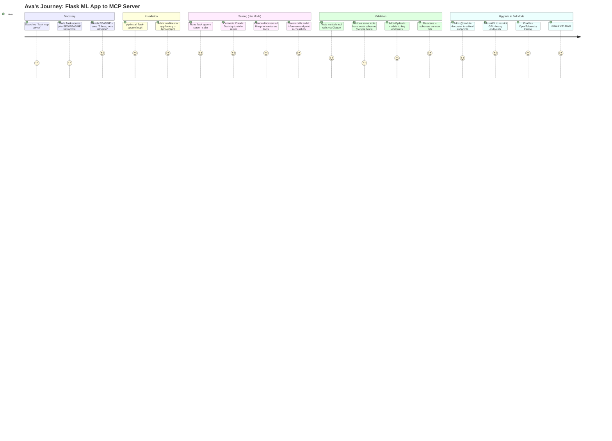
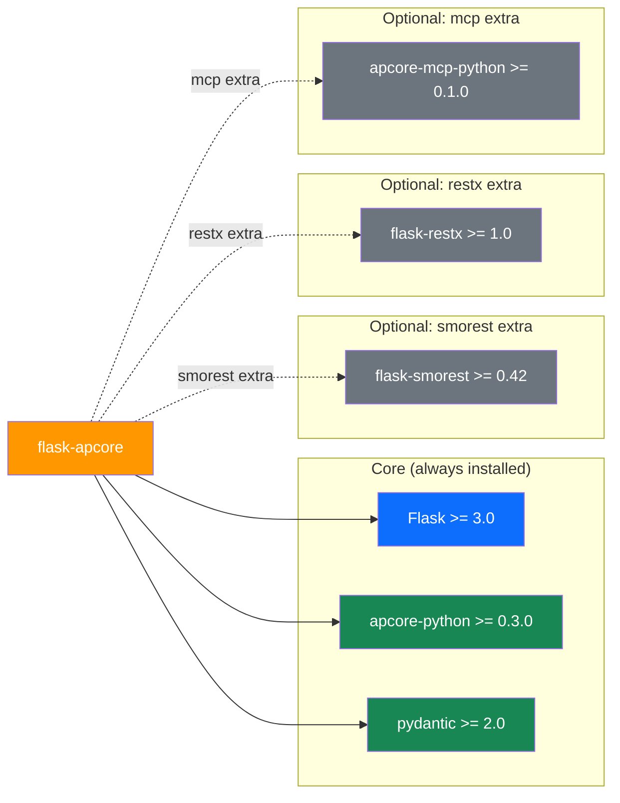
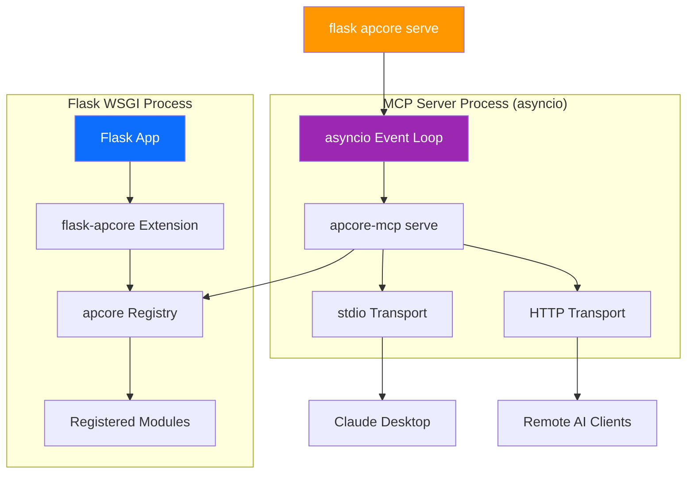
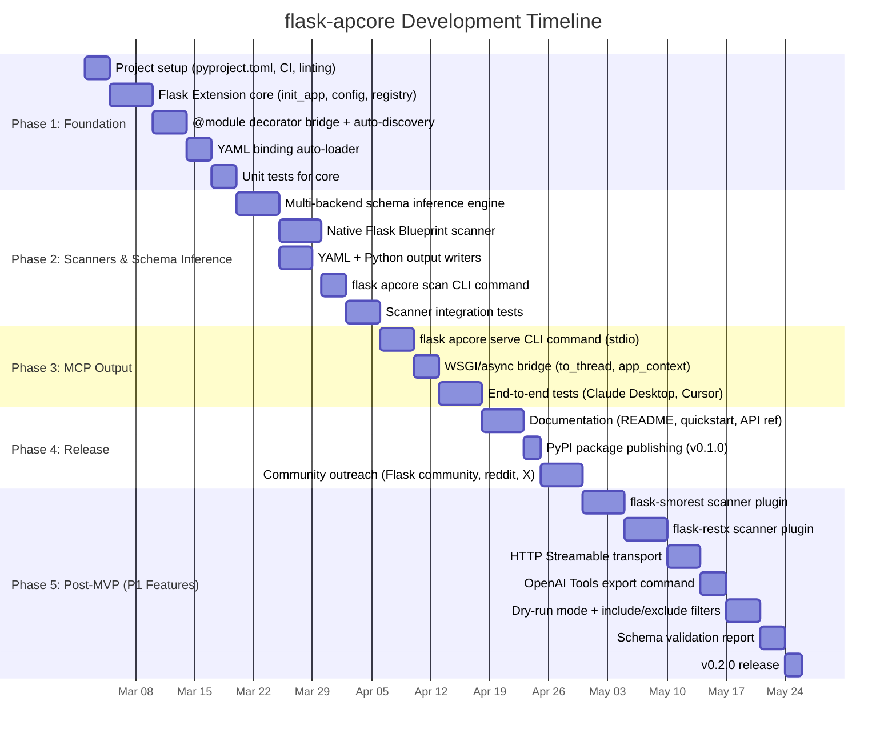

# Product Requirements Document: flask-apcore

---

## 1. Document Information

| Field              | Value                                                      |
| ------------------ | ---------------------------------------------------------- |
| Product Name       | flask-apcore                                               |
| Document Version   | 1.0                                                        |
| Author             | Product Team                                               |
| Status             | Draft                                                      |
| Created            | 2026-02-20                                                 |
| Last Updated       | 2026-02-20                                                 |
| Repository         | /Users/tercel/WorkSpace/aipartnerup/flask-apcore/          |
| Sister Projects    | apcore-python, apcore-mcp-python, django-apcore            |
| Idea Source        | ideas/flask-apcore-idea.md (validated idea)                |

---

## 2. Revision History

| Version | Date       | Author       | Changes                                                |
| ------- | ---------- | ------------ | ------------------------------------------------------ |
| 0.1     | 2026-02-20 | Product Team | Initial idea validation and competitive analysis       |
| 1.0     | 2026-02-20 | Product Team | Full PRD based on validated idea and clarification Q&A |

---

## 3. Executive Summary

**flask-apcore** is an open-source Python library that brings the apcore (AI-Perceivable Core) protocol to Flask. It enables Flask developers to expose their existing routes and business logic as MCP Servers and OpenAI-compatible Tools through a progressive integration model: from a 3-line zero-config Lite Mode to a full-governance Full Mode with ACL, middleware pipelines, and distributed tracing.

Flask is the most popular Python web micro-framework with approximately 68,000 GitHub stars and 9 million monthly PyPI downloads, yet its AI/MCP integration space is virtually empty. The strongest existing project (mcp-utils) has only 5 stars and 26,000 downloads. By contrast, FastAPI's fastapi-mcp has captured 11,600 stars and 6.68 million downloads -- proving that framework-specific MCP integration is a high-demand category. Flask's MCP gap is the single largest untapped opportunity in the Python AI integration space.

flask-apcore addresses this gap through three integration paths that mirror apcore's progressive depth philosophy: (1) **Blueprint scanning** (Lite Mode) for zero-intrusion auto-discovery of existing routes, (2) **@module decorator** (Full Mode) for precise control over new AI-callable functions, and (3) **YAML binding** for zero-code-modification external configuration. Unlike fastapi-mcp which converts endpoints to a single MCP protocol, flask-apcore converts Flask routes to apcore Modules -- enabling output to MCP, HTTP, CLI, OpenAI Tools, or any future protocol from a single definition.

This is a personal open-source project by a solo developer with no hard deadlines. Success is measured by PyPI downloads, GitHub stars, community feedback, and proving the viability of the apcore protocol within the Flask ecosystem.

---

## 4. Product Overview & Background

### 4.1 What Is apcore?

apcore (AI-Perceivable Core) is a language-agnostic specification for schema-driven, AI-perceivable modules. Its core principle is that every callable interface should be natively understandable by AI agents through mandatory `input_schema`, `output_schema`, and `description` fields. The apcore specification defines:

- **Directory-as-ID convention**: Module identity derived from filesystem structure
- **10-step Executor pipeline**: Including ACL checks, middleware, schema validation, execution, and observability
- **ACL system**: Module-to-module permission control
- **Middleware pipeline**: Onion-model request/response processing independent of the host framework
- **Observability**: OpenTelemetry-based distributed tracing across module calls

### 4.2 What Is apcore-python?

apcore-python (v0.3.0) is the Python SDK implementing the apcore specification. It provides:

- **Module base class** and **@module decorator** for defining AI-perceivable functions
- **FunctionModule** for wrapping existing functions
- **YAML BindingLoader** for external, zero-code module definitions
- **Registry** with auto-discovery and manual registration
- **Executor** implementing the full 10-step pipeline
- **ACL, middleware, and schema validation** as first-class concerns

### 4.3 What Is apcore-mcp-python?

apcore-mcp-python is the bridge library that converts any apcore Registry into:

- **MCP Server** (stdio / streamable-http) via `serve(registry)`
- **OpenAI-compatible Tools** via `to_openai_tools(registry)`

It is a zero-intrusion library -- it reads from an apcore Registry without modifying the original modules. This is the same output layer used by django-apcore.

### 4.4 What Is flask-apcore?

flask-apcore is the Flask implementation layer that:

1. Provides a **Flask Extension** (`Apcore(app)` / `apcore.init_app(app)`) with configuration, startup hooks, and auto-discovery
2. Offers a **triple-path integration model**: Blueprint scanning (Lite Mode), @module decorator (Full Mode), and YAML binding (zero-code)
3. Includes **multi-framework scanner support**: native Flask routes, flask-smorest, and flask-restx
4. Exposes **Click CLI commands** (`flask apcore scan`, `flask apcore serve`) for the zero-intrusion workflow
5. Delegates MCP/OpenAI output to apcore-mcp-python (optional dependency)
6. Handles the **WSGI/async split**: Flask app stays synchronous WSGI, MCP Server runs on an independent asyncio event loop

### 4.5 Why Now?

- **MCP adoption has exploded**: 10,000+ active MCP servers, 97M monthly SDK downloads (Dec 2025). Anthropic, OpenAI, Google, and Microsoft all support MCP.
- **Flask's MCP gap is the largest in Python**: ~9M monthly downloads, ~68K stars, yet the best MCP project has 5 stars and 26K downloads. The gap dwarfs even Django's pre-django-mcp-server era.
- **fastapi-mcp proves the model**: 11,600 stars, 6.68M downloads proves framework-specific MCP integration is a high-demand category. Flask developers deserve the same experience.
- **Competitive window is 6-12 months**: No serious Flask MCP project exists. This window will close as the ecosystem matures.
- **apcore ecosystem is reaching critical mass**: With apcore-python at v0.3.0, apcore-mcp-python shipped, and django-apcore in development, Flask is the natural next framework to support. The "apcore covers all major Python frameworks" narrative requires Flask coverage.

---

## 5. Market Research & Analysis

### 5.1 Total Addressable Market (TAM)

The TAM represents all Python web developers who could benefit from exposing their applications to AI agents.

| Metric | Value | Source |
| ------ | ----- | ------ |
| Flask PyPI monthly downloads | ~9M | PyPI Stats, Feb 2026 |
| Flask GitHub stars | ~68,000 | GitHub, Feb 2026 |
| Companies using Flask | Estimated 40,000+ | Industry analysis (proportional to Django's 42,880 per 6Sense) |
| MCP monthly SDK downloads (Python + TS) | 97M | Dec 2025 |
| Active MCP servers | 10,000+ | Dec 2025 |
| Agent orchestration market (projected) | $30B by 2030 | Industry reports, 2025 |
| 2026 projection: API gateway vendors with MCP | 75% | Industry analysis |
| All developers using AI regularly | 93% | JetBrains AI Pulse 2026 |

**TAM estimate**: Flask's 9M monthly downloads represent hundreds of thousands of active Flask projects across an estimated 40,000+ companies. With 93% of developers using AI regularly, the total pool of Flask projects that could expose AI-perceivable endpoints is enormous -- bounded only by the fraction that build API endpoints (as opposed to serving HTML templates).

### 5.2 Serviceable Addressable Market (SAM)

The SAM narrows to Flask developers who actively build APIs and could realistically adopt flask-apcore.

| Segment | Estimated % of Flask Community | Rationale | Source |
| ------- | ------------------------------ | --------- | ------ |
| REST API developers (native Flask) | ~40-50% | Flask is heavily used for microservices and APIs | Community surveys |
| flask-smorest users | ~5-8% | Structured OpenAPI-first Flask APIs | PyPI (~180K monthly downloads) |
| flask-restx users | ~8-12% | Swagger/OpenAPI auto-documented APIs | PyPI (~800K monthly downloads) |
| ML/AI teams using Flask | ~10-15% | Flask is popular for ML model serving (simpler than Django) | Industry analysis |

**SAM estimate**: Approximately 50-60% of Flask developers build APIs of some form (Flask is more API-centric than Django's 80% full-stack split). Applied to the estimated 40,000+ companies: roughly 20,000-24,000 companies have Flask API endpoints that could be exposed as MCP tools. Flask's position as the go-to framework for ML model serving adds an additional high-value segment of ML/AI teams.

### 5.3 Serviceable Obtainable Market (SOM)

The SOM accounts for realistic adoption constraints.

| Factor | Impact |
| ------ | ------ |
| Flask projects that are API-first | Higher than Django (Flask's micro-framework nature attracts API builders) |
| apcore is an unknown protocol | Early adopters only (~2-5% of SAM) |
| Solo developer, no marketing budget | Organic growth only |
| No serious competition exists | Less fragmentation to overcome than Django's 8+ MCP packages |
| Flask's weaker typing ecosystem | Schema inference is harder, reducing auto-discovery quality |

**SOM estimate (Year 1)**: 1,000-3,000 monthly PyPI downloads, targeting early-adopter Flask API developers and ML/AI teams. Flask's lack of any serious MCP solution (unlike Django's fragmented-but-present ecosystem) means flask-apcore has a clearer path to becoming the default choice. The SOM ceiling is higher than django-apcore's because the competitive landscape is weaker, but the floor may be lower because Flask developers tend to be more DIY-oriented (preferring to wire solutions manually rather than install frameworks).

### 5.4 Market Trends

**Favorable:**
- MCP protocol adoption is accelerating across all major AI providers (Anthropic, OpenAI, Google, Microsoft)
- Flask remains the #1 or #2 Python web framework by downloads, with a loyal community
- ML/AI model serving is a growing use case where Flask dominates over Django
- fastapi-mcp's success at 11.6K stars proves massive demand for framework-MCP bridges
- The complete absence of quality Flask MCP solutions creates a greenfield opportunity

**Unfavorable:**
- Flask's lack of built-in type hints and schema enforcement makes auto-discovery harder than FastAPI
- Flask developers tend toward minimalism -- they may resist additional dependencies
- WSGI/async tension means MCP transport cannot be as seamless as FastAPI's ASGI-native approach
- FastAPI's growth trajectory may be pulling API-focused developers away from Flask
- "Flask is legacy" perception in some circles may limit enthusiasm for new Flask tooling

### 5.5 Corporate MCP Adoption Timeline

| Date | Event |
| ---- | ----- |
| Nov 2024 | Anthropic open-sources MCP |
| Mar 2025 | OpenAI adopts MCP |
| Apr 2025 | Google DeepMind confirms Gemini MCP support |
| 2025 | Microsoft, Cloudflare, Vercel, Netlify add MCP support |
| Aug 2025 | fastapi-mcp hits #1 trending on GitHub for Python |
| Dec 2025 | 10,000+ active MCP servers, 97M monthly SDK downloads |
| Feb 2026 | Flask MCP landscape: best project has 5 stars (mcp-utils) |
| 2026 (proj.) | 75% of API gateway vendors expected to have MCP features |

---

## 6. Value Proposition & Validation

### 6.1 Core Value Proposition

**For Flask developers** who need to expose their APIs and business logic to AI agents, **flask-apcore** provides a progressive-depth integration from 3-line MCP server to full AI module governance -- **unlike** existing Flask MCP projects that are manual-registration-only utilities with no auto-discovery, and **unlike** fastapi-mcp which requires abandoning Flask entirely and limits output to a single MCP protocol.

**"Simple to start, deep when needed."**

- **Lite Mode (3 lines)**: `Apcore(app)` + `flask apcore serve` -- scan all Blueprints, expose as MCP tools. Competes head-to-head with fastapi-mcp's developer experience.
- **Full Mode (progressive)**: Add @module decorators for precise control, ACL for permissions, middleware for cross-cutting concerns, OpenTelemetry for tracing. Unlocks enterprise-grade AI module governance.

### 6.2 Key Differentiators

| Capability | fastapi-mcp | flask-mcp-server | mcp-utils | flask-apcore |
| ---------- | ----------- | ---------------- | --------- | ------------ |
| Auto route discovery | Yes | No (manual) | No | Yes (Blueprint scanner) |
| Zero-config setup | 3 lines | No | No | 3 lines (Lite Mode) |
| Schema inference | Pydantic only | None | None | Multi-backend (marshmallow, Pydantic, type hints, YAML) |
| Multi-protocol output | MCP only | MCP only | MCP only | MCP + OpenAI Tools + HTTP + CLI |
| ACL system | No | No | No | Yes (module-to-module permissions) |
| Middleware pipeline | No (uses FastAPI's) | No | No | Yes (onion model, independent) |
| Distributed tracing | No | No | No | Yes (OpenTelemetry) |
| Inter-module calls | No | No | No | Yes |
| Zero-code YAML binding | No | No | No | Yes |
| Framework scanner plugins | N/A | N/A | N/A | flask-smorest, flask-restx, native Flask |

### 6.3 Demand Evidence (Concrete, Not Assumed)

| Evidence | Detail | Source |
| -------- | ------ | ------ |
| 9M monthly Flask downloads | Flask remains one of the most popular Python frameworks | PyPI Stats, Feb 2026 |
| Zero quality MCP integration | Best project: mcp-utils with 5 stars, 26K downloads | GitHub/PyPI, Feb 2026 |
| flask-mcp-server: 2 stars, 2K downloads | The only named "Flask MCP" package is nearly invisible | GitHub/PyPI, Feb 2026 |
| flaskmcp repo deleted | A previous attempt was abandoned entirely | GitHub, 2025 |
| fastapi-mcp market proof | 11,600 stars, 6.68M downloads proves framework-MCP bridges are high-demand | GitHub/PyPI, Feb 2026 |
| Flask ML serving dominance | Flask is the default for ML model serving (simpler than Django, lighter than FastAPI) | Community practice |
| MCP SDK downloads: 97M/month | The protocol is mainstream, not niche | Dec 2025 |

### 6.4 What Happens If We Don't Build This?

If flask-apcore is not built, Flask developers who need MCP capabilities will:

1. **Use mcp-utils** (5 stars, 26K downloads) -- a sync utility library that requires manual tool registration, has no auto-discovery, and no schema enforcement. It works but provides no "framework integration" experience.

2. **Use the official MCP Python SDK directly** -- requires manual integration, no Flask-native patterns, significant boilerplate for each tool. This is what most Flask developers currently do.

3. **Use flask-mcp-server** (2 stars, 2K downloads) -- barely adopted, manual registration, no community momentum.

4. **Migrate to FastAPI + fastapi-mcp** -- this is the most dangerous outcome. fastapi-mcp's "just works" 3-line experience (11,600 stars) creates overwhelming gravitational pull. Every Flask developer who migrates for MCP is one fewer Flask developer in the ecosystem. This migration pressure is already real -- FastAPI's growth is partly driven by Flask developers seeking modern features.

5. **Wait for someone else to build it** -- the 6-12 month competitive window means someone will fill this gap. If it is a pure MCP transport layer (like flask-mcp-server but better), it captures mindshare without providing apcore's protocol-level governance. The apcore ecosystem loses the Flask segment permanently.

**The cost of inaction is not "nothing changes" -- it is continued zero-coverage of Flask's 9M-download ecosystem, continued migration pressure toward FastAPI, and the apcore protocol remaining absent from the most popular Python micro-framework.**

---

## 7. Feasibility Analysis

### 7.1 Technical Feasibility

| Component | Feasibility | Rationale |
| --------- | ----------- | --------- |
| Flask Extension (`init_app`) | **High** | Standard Flask extension pattern, well-documented, widely used |
| Blueprint scanner (native Flask) | **Medium-High** | `app.url_map` provides route enumeration; `app.view_functions` provides callables. Challenge: Flask routes often lack type hints, so schema inference is weaker than FastAPI |
| @module decorator bridge | **High** | apcore-python v0.3.0 provides complete decorator support; flask-apcore only needs bridging and Flask-context injection |
| YAML binding support | **High** | apcore BindingLoader is already built; flask-apcore just needs to wire auto-loading on startup |
| Multi-backend schema inference | **Medium** | marshmallow schemas (via flask-smorest) and Pydantic models are well-structured; native type hints are sparse in typical Flask code; fallback to string-type parameters is necessary |
| flask-smorest scanner | **Medium-High** | flask-smorest uses marshmallow schemas with `@blp.arguments()` / `@blp.response()` decorators; schema extraction is structured |
| flask-restx scanner | **Medium-High** | flask-restx provides `api.models` and `@api.expect()` / `@api.marshal_with()` decorators; Swagger schema extraction is documented |
| MCP Server output (stdio) | **High** | apcore-mcp-python's `serve(registry)` handles the entire MCP layer; flask-apcore only calls it |
| MCP Server output (HTTP Streamable) | **Medium** | Requires running an async MCP server alongside or independently of Flask's WSGI server; apcore-mcp-python handles the server, but orchestration needs design |
| WSGI/async split | **Medium** | Flask is WSGI-synchronous; MCP Server (via apcore-mcp-python) runs on asyncio. The `flask apcore serve` command launches an independent asyncio event loop. This is architecturally clean but means the MCP server is a separate process/thread, not embedded in Flask's request cycle |
| Click CLI commands | **High** | Flask uses Click natively; `flask apcore scan` and `flask apcore serve` are natural extensions |

**Technical verdict**: All P0 components are technically feasible. The highest-risk component is multi-backend schema inference due to Flask's historically weak typing culture. The WSGI/async split is an architectural challenge but not a blocker -- the clean separation (Flask WSGI for HTTP, independent asyncio for MCP) is actually simpler than trying to embed async MCP into a WSGI server.

### 7.2 Resource Feasibility

| Factor | Assessment |
| ------ | ---------- |
| Developer | Solo developer, personal project |
| Timeline | No hard deadlines; quality over speed |
| Dependencies | apcore-python v0.3.0 (stable), apcore-mcp-python (already built) |
| External dependencies | Flask 3.x (stable), Pydantic >= 2.0 (stable), MCP Python SDK (stable, 409M downloads) |
| Reference implementation | django-apcore provides proven architecture patterns to adapt |
| Infrastructure | PyPI publishing, GitHub hosting -- no cost |

**Resource verdict**: The project is resource-feasible for a solo developer because: (a) critical dependencies are already built or stable, (b) django-apcore provides a reference architecture to adapt rather than invent from scratch, (c) Flask's extension pattern is simpler than Django's AppConfig pattern, and (d) there are no infrastructure costs or team coordination overhead.

### 7.3 Market Feasibility

| Factor | Assessment |
| ------ | ---------- |
| Demand signal strength | **Medium-High** -- 9M monthly Flask downloads with zero quality MCP integration is a clear gap; fastapi-mcp's success proves the category |
| Competitive positioning | **Very Strong** -- no competitor exists with auto-discovery, schema inference, or multi-protocol output |
| Adoption barriers | **Medium** -- apcore is an unknown protocol; Flask developers are minimalist and may resist dependencies; "flask-apcore" is not discoverable via "flask mcp" search |
| Community risk | **Low-Medium** -- unlike Django (8+ competing packages), Flask has no entrenched MCP community to compete with |
| Flask ecosystem alignment | **Medium** -- Flask's "micro" philosophy values simplicity; flask-apcore must feel lightweight, not heavy |

### 7.4 Feasibility Verdict

**CONDITIONAL GO**

Conditions for proceeding:

1. **Lite Mode must feel genuinely lightweight.** Flask developers chose Flask because it is minimal. If flask-apcore requires complex configuration or heavy dependencies, it violates the framework's ethos. The 3-line Lite Mode must work without requiring Pydantic, marshmallow, or any schema library -- falling back to basic type-hint inference or string parameters.

2. **Schema inference quality must be tested against real Flask projects.** Unlike FastAPI (where Pydantic models guarantee rich schemas) or Django (where DRF serializers provide structure), many Flask routes have bare `def endpoint():` with no type annotations. The scanner must handle this gracefully -- producing usable (if basic) MCP tools rather than failing or producing garbage schemas.

3. **Discoverability must be addressed proactively.** The package description, README, and PyPI metadata must prominently feature "flask mcp server" keywords. Without this, developers searching for Flask MCP solutions will not find the project. Consider registering `flask-mcp-apcore` as a PyPI alias.

4. **apcore-python v0.3.0 must remain stable.** Since flask-apcore depends on apcore-python, any instability in the SDK propagates. The same developer controls both, so this is manageable but must be prioritized.

5. **Solo developer risk must be acknowledged.** Two apcore framework integrations (django-apcore + flask-apcore) are a significant maintenance burden. Prioritization between the two projects must be deliberate.

**Rationale for CONDITIONAL GO (not unconditional)**: The primary risk is that Flask's weak typing culture produces poor-quality auto-discovered schemas -- undermining the "zero-config" promise that makes fastapi-mcp successful. FastAPI's Pydantic-native architecture guarantees rich schemas; Flask guarantees nothing. If the Blueprint scanner produces tools with `{"type": "string"}` for every parameter, the user experience will be poor regardless of architectural elegance. Early validation of scanner output quality on real Flask projects is essential before committing to the full roadmap.

---

## 8. Problem Statement

### 8.1 The Problem

Flask developers who want to expose their application logic to AI agents (via MCP or OpenAI tool calling) face three compounding problems:

1. **No viable solution exists**: The entire Flask MCP ecosystem has fewer than 35 GitHub stars combined. The "best" option (mcp-utils, 5 stars) is a utility library requiring manual tool registration. There is no auto-discovery, no schema inference, no framework-native integration. Flask developers must either build from scratch with the MCP Python SDK or abandon Flask entirely.

2. **Migration pressure toward FastAPI**: fastapi-mcp's 11,600-star, 6.68M-download success creates a powerful signal: "If you want AI integration, use FastAPI." Flask developers evaluating MCP adoption see a mature, zero-config FastAPI solution and a barren Flask landscape. This accelerates Flask-to-FastAPI migration for AI use cases, fragmenting codebases.

3. **No schema governance for AI tools**: Even when Flask developers manually create MCP tools, there is no enforcement of input/output schemas, no mandatory descriptions, and no structured module contracts. The resulting tools are unreliable for AI agent consumption -- AI agents cannot reason about tools that lack structured metadata.

### 8.2 Who Is Affected

| User Segment | Size | Pain |
| ------------ | ---- | ---- |
| Flask API developers (native routes) | ~40-50% of Flask devs | Have working APIs but no path to MCP without manual boilerplate |
| ML/AI teams serving models via Flask | ~10-15% of Flask devs | Need to expose inference endpoints to AI agents; currently using ad-hoc JSON APIs |
| flask-smorest users | ~5-8% of Flask devs | Have marshmallow-schema-rich APIs that are closest to MCP-ready, but no bridge exists |
| flask-restx users | ~8-12% of Flask devs | Have Swagger-documented APIs with model definitions, but no MCP conversion path |
| Flask developers evaluating FastAPI migration | Growing segment | Considering switching frameworks solely for MCP/AI integration |

### 8.3 Current Workarounds and Their Costs

| Workaround | Cost |
| ---------- | ---- |
| Use mcp-utils (5 stars) | Manual tool registration, sync-only, no auto-discovery, no schema inference |
| Use flask-mcp-server (2 stars) | Barely adopted, manual registration, no community momentum or support |
| Use MCP Python SDK directly | Significant boilerplate per tool, no Flask-native patterns, manual schema definition |
| Switch to FastAPI + fastapi-mcp | Abandons Flask expertise, splits tech stack, migration cost, retraining team |
| Do nothing | AI agents cannot interact with the Flask application |

---

## 9. Goals and Non-Goals

### 9.1 Goals

| ID | Goal | Measurable Target |
| -- | ---- | ----------------- |
| G1 | Enable 3-line MCP Server creation from existing Flask projects (Lite Mode) | `Apcore(app)` + `flask apcore serve` works with zero additional configuration |
| G2 | Enforce schema quality on all AI-perceivable modules | 100% of modules have input_schema, output_schema, and description |
| G3 | Support triple-path integration (Blueprint scan, @module decorator, YAML binding) | All three paths produce valid apcore modules that pass schema validation |
| G4 | Support multi-backend schema inference | marshmallow, Pydantic, type hints, and YAML schemas all produce valid apcore schemas |
| G5 | Prove apcore protocol viability in Flask | At least 1 documented production deployment within 6 months |
| G6 | Achieve meaningful PyPI adoption | 1,000+ monthly downloads within 3 months of release |
| G7 | Enable multi-output from single definition | Same module definition works as MCP Server AND OpenAI Tools |
| G8 | Provide Flask-idiomatic developer experience | Extension pattern, Click CLI, Blueprint integration -- feels like a Flask library, not a foreign framework |

### 9.2 Non-Goals (Explicit Exclusions)

| ID | Non-Goal | Rationale |
| -- | -------- | --------- |
| NG1 | Replacing Flask's request handling | flask-apcore augments Flask, not replaces it. HTTP routes continue to work normally. |
| NG2 | Embedding MCP transport inside Flask's WSGI server | WSGI is synchronous; MCP requires async. The MCP server runs independently via `flask apcore serve`. Attempting to embed it creates unnecessary complexity. |
| NG3 | Supporting Flask versions below 3.0 | Flask 3.x is the current stable line; older versions lack modern features (e.g., improved CLI). |
| NG4 | Building a Flask admin dashboard (MVP) | Flask has no built-in admin; building one is a separate project. Deferred to P2. |
| NG5 | Supporting Quart or other ASGI Flask alternatives | Quart has a different runtime model. If ASGI is needed, FastAPI + fastapi-mcp is the better choice. |
| NG6 | Competing with or replacing fastapi-mcp | Different framework, complementary positioning. flask-apcore serves Flask developers; fastapi-mcp serves FastAPI developers. |
| NG7 | Building a commercial product or SaaS | Pure open-source, community adoption focus. |
| NG8 | Full-stack template route scanning | Flask routes that render Jinja2 templates (returning HTML) cannot be meaningfully converted to MCP tools. Only JSON/API routes are scannable. |

---

## 10. User Personas

### Persona 1: Ava -- ML Engineer Serving Models via Flask

| Attribute | Detail |
| --------- | ------ |
| Role | ML Engineer |
| Company | AI startup (Seed stage, 8 people) |
| Flask experience | 3 years (chose Flask for model serving -- lighter than Django, simpler than FastAPI) |
| API style | Native Flask routes with Pydantic models for request/response validation |
| AI tools usage | Daily -- Claude, GPT-4, Cursor |
| Pain point | Needs to expose ML inference endpoints to Claude Desktop for internal testing; evaluated fastapi-mcp but the entire serving stack is Flask |
| Goal | Turn existing Flask inference endpoints into MCP tools without rewriting any serving code |
| Entry point | `pip install flask-apcore[mcp]` then `flask apcore serve --stdio` |
| Depth | Starts with Lite Mode (Blueprint scan), upgrades to Full Mode when adding ACL to restrict which agents can call expensive GPU endpoints |

### Persona 2: Marcus -- Backend Developer at a SaaS Company

| Attribute | Detail |
| --------- | ------ |
| Role | Senior Backend Developer |
| Company | B2B SaaS (30 people, Series A) |
| Flask experience | 4 years |
| API style | flask-smorest with marshmallow schemas, full OpenAPI documentation |
| AI tools usage | Moderate -- GitHub Copilot, occasional Claude |
| Pain point | Product team wants to expose internal APIs to AI agents for customer support automation; CTO evaluated switching to FastAPI but the codebase is 80K lines of Flask |
| Goal | Expose existing flask-smorest endpoints as MCP tools without migrating frameworks |
| Entry point | `pip install flask-apcore[smorest]` then `flask apcore scan --source smorest` |
| Depth | Starts with Lite Mode scan, then adds YAML binding overrides to customize descriptions for AI consumption |

### Persona 3: Lin -- Solo Developer Building an AI-Native Product

| Attribute | Detail |
| --------- | ------ |
| Role | Full-stack indie developer |
| Company | Solo/bootstrapped |
| Flask experience | 2 years |
| API style | Native Flask routes, minimal structure, learning Pydantic |
| AI tools usage | Heavy -- building a product where AI agents are the primary consumers of the API |
| Pain point | Wants to define AI-callable modules from scratch with enforced schemas; tired of manually writing JSON Schema for each MCP tool |
| Goal | Use `@module` decorator to define clean, schema-enforced modules that AI agents can discover and call |
| Entry point | `from flask_apcore import module` then writes `@module`-decorated functions with Pydantic type hints |
| Depth | Full Mode from day one -- uses ACL to control which AI agents can call which modules, middleware for logging, YAML bindings for external configuration |

---

## 11. User Stories

### US-01: Lite Mode -- 3-Line MCP Server from Existing Flask App

**As** Ava (ML engineer with existing Flask app), **I want to** add 3 lines of code and run one command to expose my Flask routes as MCP tools, **so that** I can connect Claude Desktop to my Flask app immediately.

**Acceptance Criteria:**
- Adding `from flask_apcore import Apcore; apcore = Apcore(app)` and running `flask apcore serve --stdio` produces a working MCP Server
- All Blueprint routes with JSON-returning endpoints are auto-discovered
- Each discovered route becomes an MCP tool with name, description (from docstring), and parameters (from type hints or argument names)
- Routes with no type hints produce basic string-type parameters (graceful degradation)
- The MCP server connects successfully to Claude Desktop via stdio

### US-02: Blueprint Scanning with Schema Inference

**As** Marcus (flask-smorest developer), **I want to** scan my existing Blueprints and have the scanner automatically extract marshmallow schemas, **so that** my MCP tools have rich, accurate input/output definitions.

**Acceptance Criteria:**
- `flask apcore scan --source smorest` discovers all flask-smorest Blueprint routes
- marshmallow schemas from `@blp.arguments()` are converted to apcore input_schema (JSON Schema)
- marshmallow schemas from `@blp.response()` are converted to apcore output_schema (JSON Schema)
- Descriptions are extracted from docstrings and OpenAPI summaries
- Output is written as YAML binding files to a configurable directory (default: `apcore_modules/`)
- Endpoints with missing schemas generate a warning, not a failure
- The command completes in under 10 seconds for a project with 100 endpoints

### US-03: Define New Module with @module Decorator

**As** Lin (AI-native developer), **I want to** define AI-callable modules using a Python decorator with Pydantic type hints, **so that** I get schema enforcement and AI-perceivability without manual JSON Schema writing.

**Acceptance Criteria:**
- `@module(description="...", tags=[...])` decorator registers a function as an apcore module
- Input schema is auto-generated from function parameter Pydantic type hints
- Output schema is auto-generated from return type annotation
- Functions can access Flask's application context (e.g., `current_app`, database connections)
- Modules are auto-discovered on Flask app initialization
- Missing description raises a validation error at registration time

### US-04: YAML Binding for Zero-Code Module Definition

**As** Marcus (SaaS developer), **I want to** define apcore modules entirely in YAML files that reference my existing Flask route functions, **so that** I can add AI-perceivability to my codebase without modifying any Python source code.

**Acceptance Criteria:**
- YAML binding files in the configured directory are auto-loaded on Flask app startup
- Each YAML file references a Python callable (e.g., `callable: myapp.views.get_user`)
- YAML files can define input_schema, output_schema, and description
- Schema can be inline JSON Schema, a reference to a Pydantic model, or auto-inferred from the callable
- Invalid YAML files produce clear error messages with file path and line number

### US-05: Start MCP Server via CLI

**As** any flask-apcore user, **I want to** start an MCP Server from my registered modules with a single CLI command, **so that** AI agents can discover and call my Flask endpoints.

**Acceptance Criteria:**
- `flask apcore serve --stdio` starts an MCP Server using stdio transport
- `flask apcore serve --http --host 0.0.0.0 --port 9000` starts an HTTP Streamable MCP Server
- The MCP server runs on an independent asyncio event loop (not inside Flask's WSGI server)
- The server lists all registered tools with their schemas when queried by an MCP client
- A tool call executes the underlying Flask function and returns structured output
- Requires `apcore-mcp-python` optional dependency; provides a clear error message if not installed

### US-06: Scan flask-restx Endpoints

**As** a flask-restx developer, **I want to** scan my existing flask-restx namespaces and have the scanner extract Swagger model definitions, **so that** my MCP tools have structured schemas from my existing API documentation.

**Acceptance Criteria:**
- `flask apcore scan --source restx` discovers all flask-restx Namespace routes
- `api.model()` definitions are converted to apcore input/output schemas
- `@api.expect()` and `@api.marshal_with()` decorators inform schema extraction
- Descriptions are extracted from route docstrings and Swagger documentation
- Output format matches the same YAML structure as other scanners

### US-07: Export as OpenAI Tools

**As** a developer integrating with OpenAI-compatible APIs, **I want to** export my apcore modules as OpenAI tool definitions, **so that** I can use them with GPT-4, Claude API, or any OpenAI-compatible service.

**Acceptance Criteria:**
- The apcore Registry populated by flask-apcore can be passed to `to_openai_tools(registry)` from apcore-mcp-python
- Output conforms to OpenAI's tool calling JSON Schema format
- Each tool includes name, description, and parameters with JSON Schema
- CLI command `flask apcore export --format openai` outputs tool definitions to stdout or a file

### US-08: Configure via Flask App Config

**As** any flask-apcore user, **I want to** configure flask-apcore behavior through standard Flask app configuration, **so that** I do not need to learn a separate configuration system.

**Acceptance Criteria:**
- `app.config['APCORE_MODULE_DIR']` controls where modules are loaded from (default: `apcore_modules/`)
- `app.config['APCORE_AUTO_DISCOVER']` controls whether modules are auto-discovered on startup (default: `True`)
- `app.config['APCORE_SERVE_TRANSPORT']` controls default transport (default: `stdio`)
- `app.config['APCORE_SCANNER_SOURCE']` controls default scanner source (default: `auto`)
- Invalid configuration raises clear error messages on app initialization
- All settings have sensible defaults -- zero configuration required for Lite Mode

### US-09: Dry-Run Mode for Scanner

**As** Marcus (SaaS developer with a large codebase), **I want to** preview what the scanner would generate before writing any files, **so that** I can review and approve the module definitions before committing them.

**Acceptance Criteria:**
- `flask apcore scan --dry-run` outputs what would be generated to stdout without writing files
- Output includes module ID, description, input_schema summary, and output_schema summary for each discovered route
- Warnings about unconvertible routes are included in the dry-run output
- Exit code indicates whether any routes were discovered (0 = found, 1 = none found)

### US-10: Progressive Depth -- Lite to Full Mode Upgrade

**As** Ava (ML engineer who started with Lite Mode), **I want to** gradually add Full Mode features (ACL, middleware, observability) to specific modules without reconfiguring my entire setup, **so that** I can add governance incrementally as my needs grow.

**Acceptance Criteria:**
- A module initially discovered via Blueprint scan can be overridden with a YAML binding file or @module decorator
- Adding ACL rules to a specific module does not require changes to other modules
- Adding middleware to the apcore pipeline does not affect Flask's own middleware
- OpenTelemetry tracing can be enabled per-module or globally via configuration
- The upgrade path does not require re-scanning or re-generating existing module definitions

---

## 12. Functional Requirements Overview

### P0 -- Must Have (MVP Launch Blockers)

| ID | Feature | Description | User Story |
| -- | ------- | ----------- | ---------- |
| PRD-FAP-001 | Flask Extension Core | `Apcore` Flask extension with `init_app(app)` pattern, Flask config integration (`APCORE_*`), singleton Registry/Executor, and startup hooks for auto-discovery | US-08 |
| PRD-FAP-002 | Blueprint Scanner (Native Flask) | Scan `app.url_map` and `app.view_functions` to discover Flask routes, extract type hints and docstrings, generate apcore module definitions | US-01, US-02 |
| PRD-FAP-003 | @module Decorator Bridge | Bridge apcore-python's `@module` decorator into Flask's application context, enabling Flask-context-aware module functions with auto-registration | US-03 |
| PRD-FAP-004 | YAML Binding Support | Auto-load YAML binding files from configured directory on Flask app startup using apcore BindingLoader, register as modules in Registry | US-04 |
| PRD-FAP-005 | MCP Serve Command (STDIO) | `flask apcore serve --stdio` Click CLI command that loads all registered modules, launches independent asyncio event loop, and starts MCP Server via `serve(registry)` | US-05 |
| PRD-FAP-006 | Multi-Backend Schema Inference | Schema inference engine supporting: (a) Pydantic models, (b) marshmallow schemas, (c) Python type hints, (d) YAML external schemas. Auto-detect which backend is available per route. | US-01, US-02, US-03, US-04 |
| PRD-FAP-007 | Module Auto-Discovery | On Flask app initialization, scan configured directories for apcore modules (decorator-defined, YAML bindings, and scanned outputs) and register them in the apcore Registry | US-01, US-08 |
| PRD-FAP-008 | `flask apcore scan` CLI Command | `flask apcore scan --source auto|native|smorest|restx --output yaml|python --dir <path>` Click command for scanning existing routes | US-02, US-06, US-09 |

### P1 -- Should Have (Post-MVP, High Value)

| ID | Feature | Description | User Story |
| -- | ------- | ----------- | ---------- |
| PRD-FAP-009 | flask-smorest Scanner | Plugin scanner for flask-smorest Blueprints: extract marshmallow schemas from `@blp.arguments()` / `@blp.response()`, descriptions from OpenAPI spec | US-02 |
| PRD-FAP-010 | flask-restx Scanner | Plugin scanner for flask-restx Namespaces: extract `api.model()` definitions, `@api.expect()` / `@api.marshal_with()` decorators | US-06 |
| PRD-FAP-011 | HTTP Streamable Transport | `flask apcore serve --http --host <host> --port <port>` for network-accessible MCP Server via Streamable HTTP (POST JSON-RPC + GET SSE) | US-05 |
| PRD-FAP-012 | OpenAI Tools Export | `flask apcore export --format openai` CLI command to export Registry as OpenAI-compatible tool definitions via `to_openai_tools(registry)` | US-07 |
| PRD-FAP-013 | Dry-Run Mode | `flask apcore scan --dry-run` previews what modules would be generated without writing files, outputs summary to stdout | US-09 |
| PRD-FAP-014 | Scanner Include/Exclude Filters | `flask apcore scan --include <pattern> --exclude <pattern>` to selectively scan endpoints by Blueprint name, URL pattern, or tag | US-02, US-06 |
| PRD-FAP-015 | Schema Validation Report | `flask apcore scan --validate` checks generated modules against apcore schema requirements and reports issues with actionable fix suggestions | US-02, US-06 |

### P2 -- Nice to Have (Future Enhancements)

| ID | Feature | Description | User Story |
| -- | ------- | ----------- | ---------- |
| PRD-FAP-016 | Flask-Login / flask-httpauth Mapping | Bridge Flask-Login session auth and flask-httpauth to apcore ACL annotations, allowing auth-protected routes to carry permissions into MCP | US-10 |
| PRD-FAP-017 | Middleware Bridging | Map Flask `before_request` / `after_request` hooks to apcore middleware pipeline stages, enabling reuse of existing Flask middleware logic | US-10 |
| PRD-FAP-018 | Admin Dashboard (Flask-Admin) | Optional Flask-Admin integration providing a web UI showing registered modules, their schemas, call statistics, and health status | -- |
| PRD-FAP-019 | Watch Mode for Serve | `flask apcore serve --watch` reloads modules on file changes during development (similar to Flask's `--reload` for the HTTP server) | US-05 |
| PRD-FAP-020 | Context Factory | Configurable factory function that converts Flask request context (request, g, session) into apcore Context object for module execution | US-10 |
| PRD-FAP-021 | Module Health Check Endpoint | Flask route (`/apcore/health`) that reports the status of all registered apcore modules as JSON | -- |
| PRD-FAP-022 | Tag-Based Module Grouping | Group scanned/registered modules by Blueprint name, custom tags, or URL prefix for organized output and selective serving | US-02 |

**Feature Count Summary:**
- **P0 (Must Have):** 8 features
- **P1 (Should Have):** 7 features
- **P2 (Nice to Have):** 7 features
- **Total:** 22 features

---

## 13. User Journey

### 13.1 Lite Mode: Existing Flask App to MCP Server (Primary Journey)



### 13.2 User Flow Diagram

```mermaid
flowchart TD
    A[Developer has existing Flask project] --> B{Which integration path?}

    B -->|Lite Mode: Auto-discover| C[pip install flask-apcore]
    B -->|Full Mode: Precise control| D[pip install flask-apcore]
    B -->|Zero-Code: YAML binding| E[pip install flask-apcore]

    C --> F[Add Apcore to app factory]
    D --> F
    E --> F

    F --> G{Integration style?}

    G -->|Blueprint scan| H{Which scanner?}
    G -->|@module decorator| I[Write @module decorated functions]
    G -->|YAML binding| J[Write YAML binding files]

    H -->|Native Flask| H1[flask apcore scan --source native]
    H -->|flask-smorest| H2[flask apcore scan --source smorest]
    H -->|flask-restx| H3[flask apcore scan --source restx]

    H1 & H2 & H3 --> K[Review generated YAML/Python modules]
    I --> L[Modules auto-discovered on startup]
    J --> L
    K --> L

    L --> M{What output?}

    M -->|MCP Server STDIO| N[flask apcore serve --stdio]
    M -->|MCP Server HTTP| O[flask apcore serve --http]
    M -->|OpenAI Tools| P[flask apcore export --format openai]

    N --> Q[Connect AI client: Claude Desktop / Cursor]
    O --> Q
    P --> R[Use with OpenAI API / Claude API]

    Q --> S[AI agent calls Flask endpoints via MCP]
    R --> S

    style A fill:#e1f5fe
    style S fill:#c8e6c9
    style H1 fill:#fff3e0
    style H2 fill:#fff3e0
    style H3 fill:#fff3e0
    style I fill:#fff3e0
    style J fill:#fff3e0
    style N fill:#f3e5f5
    style O fill:#f3e5f5
    style P fill:#f3e5f5
```

---

## 14. Feature Architecture

### 14.1 System Architecture

```mermaid
graph TB
    subgraph "AI Clients"
        CD[Claude Desktop]
        CU[Cursor]
        OA[OpenAI API]
    end

    subgraph "Output Layer (apcore-mcp-python)"
        MCP[MCP Server<br/>stdio / streamable-http]
        OAT[OpenAI Tools<br/>JSON Schema export]
    end

    subgraph "Core Layer (flask_apcore)"
        EXT[Flask Extension<br/>Apcore init_app]
        REG[apcore Registry<br/>Singleton]
        EXEC[apcore Executor<br/>10-step pipeline]
        CFG[Flask Config<br/>APCORE_* settings]
        CLI1[flask apcore scan]
        CLI2[flask apcore serve]
        CLI3[flask apcore export]
    end

    subgraph "Integration Layer (Triple Path)"
        BP[Blueprint Scanner<br/>Auto-discovery]
        DEC[@module Decorator<br/>Precise control]
        YAML[YAML Binding<br/>Zero-code]
    end

    subgraph "Scanner Plugins"
        NS[Native Flask Scanner<br/>url_map + view_functions]
        SS[flask-smorest Scanner<br/>marshmallow schemas]
        RS[flask-restx Scanner<br/>Swagger models]
    end

    subgraph "Schema Inference Engine"
        SI_P[Pydantic Backend]
        SI_M[marshmallow Backend]
        SI_T[Type Hints Backend]
        SI_Y[YAML Schema Backend]
    end

    subgraph "Flask Application (WSGI)"
        APP[Flask App]
        BPS[Blueprints]
        ROUTES[Route Functions]
        SMOREST[flask-smorest views]
        RESTX[flask-restx resources]
    end

    CD & CU -->|MCP protocol| MCP
    OA -->|Tool calling| OAT

    MCP --> REG
    OAT --> REG

    EXT --> REG & EXEC & CFG
    CLI1 --> BP
    CLI2 --> MCP
    CLI3 --> OAT

    BP --> NS & SS & RS
    NS --> SI_T
    SS --> SI_M
    RS --> SI_T

    DEC --> REG
    YAML --> REG
    BP -->|Generates| YAML

    NS --> ROUTES & BPS
    SS --> SMOREST
    RS --> RESTX

    SI_P & SI_M & SI_T & SI_Y --> REG

    APP --> EXT

    style REG fill:#ff9800,color:#fff
    style MCP fill:#9c27b0,color:#fff
    style OAT fill:#9c27b0,color:#fff
    style EXT fill:#ff9800,color:#fff
    style NS fill:#2196f3,color:#fff
    style SS fill:#2196f3,color:#fff
    style RS fill:#2196f3,color:#fff
    style DEC fill:#4caf50,color:#fff
    style YAML fill:#4caf50,color:#fff
    style BP fill:#4caf50,color:#fff
```

### 14.2 Dependency Architecture



### 14.3 Package Structure

```
flask-apcore/
  src/
    flask_apcore/
      __init__.py              # Apcore extension class, public API
      extension.py             # Flask Extension with init_app(), config, startup hooks
      config.py                # APCORE_* config defaults and validation
      registry.py              # Flask-aware apcore Registry singleton wrapper
      context.py               # Flask request context -> apcore Context bridge
      cli.py                   # Click CLI group: flask apcore [scan|serve|export]
      scanners/
        __init__.py            # Scanner registry and plugin interface
        base.py                # Abstract BaseScanner interface
        native.py              # Native Flask route scanner (url_map)
        smorest.py             # flask-smorest scanner (optional)
        restx.py               # flask-restx scanner (optional)
      schemas/
        __init__.py            # Schema inference dispatcher
        pydantic_backend.py    # Pydantic model -> JSON Schema
        marshmallow_backend.py # marshmallow schema -> JSON Schema
        typehints_backend.py   # Python type hints -> JSON Schema
        yaml_backend.py        # YAML external schema loader
      output/
        __init__.py
        yaml_writer.py         # YAML binding file generator
        python_writer.py       # Python @module decorator code generator
  tests/
    conftest.py                # Flask test app fixtures
    test_extension.py          # Extension init, config, auto-discovery
    test_scanner_native.py     # Native Flask scanner
    test_scanner_smorest.py    # flask-smorest scanner
    test_scanner_restx.py      # flask-restx scanner
    test_schemas.py            # Multi-backend schema inference
    test_cli.py                # CLI commands
    test_registry.py           # Registry integration
    test_yaml_binding.py       # YAML binding loading
  pyproject.toml
  README.md
```

### 14.4 WSGI/Async Architecture

The WSGI/async split is a critical architectural decision for flask-apcore. Flask is a WSGI framework (synchronous), while MCP servers (via apcore-mcp-python) run on asyncio (asynchronous). The architecture handles this cleanly:



**Key design decisions:**
1. `flask apcore serve` is a **separate process** from the Flask HTTP server. It is a Click command that creates a Flask app context, builds the Registry, then launches an asyncio event loop for the MCP server.
2. Module functions execute **synchronously** within the asyncio event loop using `asyncio.to_thread()` or `loop.run_in_executor()`. This ensures Flask ORM/database operations (which are synchronous) work correctly.
3. Flask's application context (`app_context()`) is pushed before module execution so that modules can access `current_app`, database connections, and other Flask-managed resources.

---

## 15. Success Metrics

### 15.1 Key Performance Indicators (KPIs)

| KPI | Target (3 months) | Target (6 months) | Target (12 months) | Measurement |
| --- | ------------------ | ------------------ | ------------------- | ----------- |
| PyPI monthly downloads | 1,000+ | 5,000+ | 15,000+ | PyPI Stats / pepy.tech |
| GitHub stars | 100+ | 500+ | 1,500+ | GitHub |
| GitHub issues (user-reported) | 10+ | 30+ | -- | GitHub Issues |
| Documented production deployments | 1+ | 3+ | 10+ | GitHub Discussions / README |
| Contributor count (non-author) | 1+ | 3+ | 5+ | GitHub |
| MCP client compatibility confirmed | 2+ (Claude Desktop, Cursor) | 3+ | 5+ | Testing |

**Note on targets**: flask-apcore's targets are set higher than django-apcore's because (a) the Flask MCP landscape is completely empty (no fragmentation to overcome), (b) Flask's API-centric user base is more naturally aligned with MCP, and (c) the "first credible Flask MCP library" positioning provides stronger organic discovery.

### 15.2 Qualitative Success Criteria

| Criterion | Validation Method |
| --------- | ----------------- |
| Existing Flask app: 3 lines + 1 command to MCP Server (Lite Mode) | End-to-end test with real Flask project (native routes) |
| flask-smorest project: scanner produces rich marshmallow-derived schemas | End-to-end test with real flask-smorest project |
| flask-restx project: scanner produces rich Swagger-derived schemas | End-to-end test with real flask-restx project |
| @module decorator works with Flask app context access | Unit test + integration test |
| YAML binding: zero Python modification, fully external module definition | Integration test |
| Generated MCP Server successfully connects to Claude Desktop (stdio) | Manual integration test |
| Generated MCP Server successfully connects to Cursor | Manual integration test |
| Progressive upgrade from Lite to Full Mode works without reconfiguration | Integration test |

### 15.3 Anti-Metrics (What We Do NOT Optimize For)

| Anti-Metric | Reason |
| ----------- | ------ |
| Total download count (inflated by CI) | Raw downloads are unreliable as a quality signal; stars and issues are better proxies |
| Feature count | Quality and usability of each feature matter more than breadth |
| Speed of release | Schema inference quality and Flask-idiomatic API design are more important than shipping fast |
| Scanner coverage percentage | Converting 100% of routes is not the goal; converting routes *well* is. A scanner that skips unconvertible routes with clear warnings is better than one that produces garbage for 100% of routes |

---

## 16. Timeline & Milestones



### Milestone Summary

| Milestone | Target Date | Deliverable |
| --------- | ----------- | ----------- |
| M1: Core Complete | ~Mar 20, 2026 | Flask Extension with config, auto-discovery, @module bridge, YAML binding |
| M2: Scanners Complete | ~Apr 10, 2026 | Native Flask scanner, multi-backend schema inference, scan CLI command |
| M3: MCP Output Complete | ~Apr 22, 2026 | `flask apcore serve --stdio`, WSGI/async bridge, e2e tests |
| M4: v0.1.0 Release | ~May 1, 2026 | Published on PyPI with documentation, community outreach begun |
| M5: v0.2.0 Release (P1 features) | ~Jun 15, 2026 | flask-smorest scanner, flask-restx scanner, HTTP transport, OpenAI export, dry-run, validation |

**Note:** These dates are estimates for a solo developer working part-time on a personal project. There are no hard deadlines. Dates will shift based on actual velocity, the stability of apcore-python v0.3.0, and the parallel progress of django-apcore.

---

## 17. Risk Assessment Matrix

| ID | Risk | Likelihood | Impact | Severity | Mitigation |
| -- | ---- | ---------- | ------ | -------- | ---------- |
| R1 | **Flask's weak typing produces poor auto-discovered schemas** -- native Flask routes often lack type hints, producing MCP tools with `{"type": "string"}` for every parameter | High | High | **Critical** | Multi-backend schema inference compensates: prioritize routes with Pydantic/marshmallow schemas; provide clear warnings for untyped routes; document the "add type hints for better schemas" upgrade path; Lite Mode sets realistic expectations |
| R2 | **Discoverability failure** -- developers search "flask mcp" and find nothing because package is named "flask-apcore" | High | High | **Critical** | Include "flask mcp server" prominently in PyPI description, README title, and package keywords. Consider registering `flask-mcp-apcore` as a PyPI alias. Write blog posts and community posts using "Flask MCP" terminology. |
| R3 | **apcore protocol adoption fails** -- developers prefer direct MCP over the apcore abstraction layer | Medium-High | Critical | **High** | Position flask-apcore's Lite Mode as a standalone Flask MCP solution (value even without understanding apcore). Full Mode's benefits (ACL, middleware, multi-protocol) are opt-in upsells, not requirements. |
| R4 | **Solo developer maintaining two framework integrations** -- django-apcore + flask-apcore is a significant maintenance burden | Medium-High | High | **High** | Share scanner architecture between projects (abstract base scanner). Prioritize flask-apcore v0.1.0 before django-apcore P1 features. Actively seek co-maintainers after initial release. |
| R5 | **WSGI/async tension creates subtle bugs** -- running async MCP server with sync Flask functions via `to_thread()` may cause database connection issues, context loss, or thread-safety problems | Medium | High | **High** | Extensive integration testing of the WSGI/async bridge. Ensure Flask app_context is properly pushed in worker threads. Document known limitations clearly. |
| R6 | **A simple "flask-mcp" package captures mindshare first** -- someone ships a basic but well-marketed Flask MCP package during the 6-12 month window | Medium | High | **Medium-High** | Ship Lite Mode (v0.1.0) as fast as possible to establish the name. Differentiate on depth (Full Mode features) rather than racing on simplicity. |
| R7 | **flask-smorest and flask-restx have declining usage** -- investing in scanner plugins for frameworks that are losing momentum | Low-Medium | Medium | **Medium** | flask-smorest (~180K monthly downloads) and flask-restx (~800K monthly downloads) are still significant. Scanner plugin architecture means minimal wasted investment if usage declines -- plugins are independent modules. |
| R8 | **Flask developers resist additional dependencies** -- Flask's "micro" philosophy creates resistance to installing a framework with 3 core dependencies | Medium | Medium | **Medium** | Keep core dependencies minimal (Flask, apcore-python, Pydantic). All scanner frameworks are optional extras. Lite Mode works with zero optional dependencies. Emphasize in docs: "adds 2 deps to your Flask app." |
| R9 | **MCP protocol itself loses momentum** -- replaced by a different standard | Low | Critical | **Medium** | apcore's multi-output design (MCP + OpenAI Tools) hedges this. The module definition layer is protocol-agnostic; only the output layer would need updating. |
| R10 | **apcore-python v0.3.0 introduces breaking changes** -- flask-apcore built against unstable SDK | Low-Medium | High | **Medium** | Same developer controls both projects. Pin to specific apcore-python versions. Run CI against apcore-python's main branch to catch breakages early. |

---

## 18. Dependencies

### 18.1 Internal Dependencies

| Dependency | Version | Status | Risk |
| ---------- | ------- | ------ | ---- |
| apcore-python | >= 0.3.0 | Stable (v0.3.0 released) | Low -- same team, stable API |
| apcore-mcp-python | >= 0.1.0 | Released | Low -- already built and tested |
| django-apcore | N/A (sister project) | In development | Low -- shared patterns, not a dependency |

### 18.2 External Dependencies

| Dependency | Version | Status | Risk |
| ---------- | ------- | ------ | ---- |
| Flask | >= 3.0 | Stable | Very Low |
| Pydantic | >= 2.0 | Stable | Very Low |
| flask-smorest | >= 0.42 (optional) | Stable | Low |
| flask-restx | >= 1.0 (optional) | Stable | Low |
| marshmallow | >= 3.0 (transitive via flask-smorest) | Stable | Very Low |
| MCP Python SDK | >= 1.0 (transitive via apcore-mcp-python) | Stable (409M downloads) | Very Low |

### 18.3 Infrastructure Dependencies

| Dependency | Purpose | Risk |
| ---------- | ------- | ---- |
| PyPI | Package distribution | Very Low |
| GitHub | Source hosting, CI, issues | Very Low |
| GitHub Actions | CI/CD pipeline | Very Low |

### 18.4 Knowledge Dependencies

| Dependency | Description | Risk |
| ---------- | ----------- | ---- |
| Flask Extension patterns | Understanding of `init_app()`, app context, Click CLI integration | Low -- well-documented |
| Flask's `url_map` and `view_functions` | Understanding of Flask's internal route registry for Blueprint scanning | Low -- stable internal API |
| flask-smorest internals | Understanding of `Blueprint.arguments` / `Blueprint.response` decorators and marshmallow schema extraction | Medium-Low -- less documented than Flask core |
| flask-restx internals | Understanding of `api.model()`, `@api.expect()`, `@api.marshal_with()` | Medium-Low -- Swagger model extraction |
| marshmallow-to-JSON-Schema conversion | Converting marshmallow schema fields to JSON Schema properties | Low -- well-established pattern (marshmallow-jsonschema exists) |
| asyncio + WSGI bridging | Running async MCP server with sync Flask functions via thread pool | Medium -- requires careful thread-safety design |
| apcore binding specification | Understanding of YAML binding format and BindingLoader | Low -- same team controls this |
| MCP protocol specification | Understanding of tool definitions, transports, and client expectations | Low -- specification is public |

---

## 19. Open Questions

| ID | Question | Impact | Owner | Target Resolution |
| -- | -------- | ------ | ----- | ----------------- |
| OQ-1 | **How should the Blueprint scanner handle routes with no type hints and no docstrings?** Options: (a) skip with warning, (b) generate tool with `string` type for all params and "No description" placeholder, (c) require minimum metadata via configuration. | High -- affects Lite Mode quality | Developer | Before Phase 2 completion |
| OQ-2 | **Should Lite Mode require Pydantic as a dependency, or should it work with zero schema libraries?** Removing Pydantic from core deps reduces installation friction but limits schema inference to Python type hints only. | High -- affects dependency story and Lite Mode quality | Developer | Before Phase 1 completion |
| OQ-3 | **How does Flask's app context (`app_context()`) interact with apcore's Executor running in asyncio threads?** When `serve(registry)` calls a module function via `to_thread()`, is the Flask app context available? Does `current_app` work? | High -- affects all module execution in MCP serve mode | Developer | Before Phase 3 completion |
| OQ-4 | **Should the package name be `flask-apcore` or `flask-mcp-apcore` for discoverability?** "flask-apcore" is cleaner but invisible to "flask mcp" searches. "flask-mcp-apcore" is ugly but discoverable. Could also use PyPI keywords only. | Medium-High -- affects all adoption metrics | Developer | Before v0.1.0 release |
| OQ-5 | **How should the scanner handle Flask routes that use `request.get_json()` without schema validation?** These are common in Flask but have no structured input definition. Should the scanner attempt to infer schema from the function body, or skip them? | Medium -- affects native Flask scanner coverage | Developer | During Phase 2 |
| OQ-6 | **What is the priority order between flask-apcore and django-apcore?** Both are in development by the same solo developer. Should flask-apcore v0.1.0 ship before django-apcore P1, or should they be developed in parallel? | Medium -- affects timeline for both projects | Developer | Before Phase 1 start |
| OQ-7 | **Should flask-apcore support Flask-SocketIO or WebSocket routes?** WebSocket routes are increasingly common in Flask apps; they map naturally to "streaming" MCP tool responses. But this adds complexity. | Low -- can be deferred to P2+ | Developer | Post-MVP |
| OQ-8 | **What is the upgrade path when apcore protocol evolves?** If apcore v0.4.0 changes the module schema, how do existing YAML bindings generated by flask-apcore v0.1.0 get migrated? | Medium -- affects long-term maintenance | Developer | Before v0.2.0 release |

---

## 20. Appendix

### Appendix A: Competitive Landscape Detail

**Flask MCP Ecosystem (Feb 2026):**

| Package | Stars | Downloads | Active? | Approach | Auto-Discovery? | Schema Inference? |
| ------- | ----- | --------- | ------- | -------- | --------------- | ----------------- |
| mcp-utils | 5 | 26,096 total | Active | Sync utility library | No | No |
| flask-mcp-server | 2 | 2,038 total | Minimal | Manual tool registration | No | No |
| flaskmcp | -- | 4,474 total | **Deleted** | Unknown | Unknown | Unknown |

**Cross-Framework Reference:**

| Package | Framework | Stars | Monthly Downloads | Approach |
| ------- | --------- | ----- | ----------------- | -------- |
| fastapi-mcp | FastAPI | 11,600 | 6,680,000 | Auto endpoint-to-tool, Pydantic schemas, ASGI native |
| django-mcp-server | Django | 274 | 53,000+ | Declarative tools, no schema enforcement |
| django-apcore | Django | -- (in dev) | -- | Protocol-first, scanner + decorator, apcore modules |

**Key insight**: The Flask MCP landscape is not fragmented -- it is essentially empty. Unlike Django (8+ competing packages), Flask has zero credible MCP solutions. This is both an opportunity (greenfield) and a risk (no proven demand for Flask+MCP specifically, only inferred from Flask's download volume and fastapi-mcp's success).

### Appendix B: Market Data Sources

| Data Point | Value | Source |
| ---------- | ----- | ------ |
| Flask monthly PyPI downloads | ~9M | PyPI Stats, Feb 2026 |
| Flask GitHub stars | ~68,000 | GitHub, Feb 2026 |
| flask-smorest monthly downloads | ~180K | PyPI Stats, Feb 2026 |
| flask-restx monthly downloads | ~800K | PyPI Stats, Feb 2026 |
| mcp-utils total downloads | 26,096 | PyPI, Feb 2026 |
| flask-mcp-server total downloads | 2,038 | PyPI, Feb 2026 |
| flaskmcp total downloads | 4,474 | PyPI, Feb 2026 |
| fastapi-mcp GitHub stars | 11,600+ | GitHub, Feb 2026 |
| fastapi-mcp monthly downloads | 6,680,000 | PyPI, Feb 2026 |
| MCP Python SDK monthly downloads | 97M (combined) | Dec 2025 |
| MCP Python SDK total downloads | 409M+ | PyPI, Feb 2026 |
| Active MCP servers | 10,000+ | Dec 2025 |
| All developers using AI regularly | 93% | JetBrains AI Pulse 2026 |
| Agent orchestration market (projected) | $30B by 2030 | Industry reports, 2025 |

### Appendix C: Dependency Specification

```toml
[project]
name = "flask-apcore"
version = "0.1.0"
description = "Flask MCP Server & AI module integration powered by apcore. Expose Flask routes as MCP tools and OpenAI-compatible functions with zero-config auto-discovery."
requires-python = ">=3.10"
license = "MIT"
keywords = [
    "flask",
    "mcp",
    "mcp-server",
    "flask-mcp",
    "ai",
    "apcore",
    "openai",
    "tools",
    "ai-agent",
    "model-context-protocol",
]
dependencies = [
    "flask>=3.0",
    "apcore>=0.3.0",
    "pydantic>=2.0",
]

[project.optional-dependencies]
smorest = ["flask-smorest>=0.42"]
restx = ["flask-restx>=1.0"]
mcp = ["apcore-mcp>=0.1.0"]
all = ["flask-apcore[smorest,restx,mcp]"]
dev = [
    "pytest",
    "pytest-flask",
    "ruff",
    "mypy",
    "pre-commit",
    "coverage",
]
```

### Appendix D: Key Community Signals

1. **Flask MCP landscape is barren** -- Unlike Django's 8+ competing packages (indicating demand-driven fragmentation), Flask has only 3 packages with a combined 32,608 downloads and the strongest having 5 GitHub stars. This suggests either (a) Flask developers solve MCP manually, (b) Flask developers migrate to FastAPI for MCP, or (c) the demand has not yet been surfaced. All three scenarios represent opportunity.

2. **fastapi-mcp as market proof** -- fastapi-mcp's trajectory from 0 to 11,600 stars in ~6 months (Aug 2025 trending) proves that framework-specific MCP integration is a high-demand category. Flask's comparable or larger user base suggests similar latent demand.

3. **Flask ML serving community** -- Flask is the de facto standard for lightweight ML model serving (via libraries like Flask-RESTful, gunicorn + Flask). This community has an acute need for MCP integration to expose inference endpoints to AI agents -- a use case less common in Django.

4. **flaskmcp deletion** -- The deletion of the flaskmcp repository (4,474 downloads before removal) suggests either burnout or a pivot, not lack of interest. The downloads indicate initial demand that was abandoned.

5. **No community discussions found** -- Unlike Django (which has Django Forum threads, DjangoCon keynotes), no Flask+MCP discussions were found on Reddit, Stack Overflow, Flask mailing lists, or Twitter/X. This is consistent with a pre-awareness market -- developers have not yet articulated the need because they assume no solution exists.

### Appendix E: Flask Extension Pattern Reference

flask-apcore follows Flask's standard extension pattern:

```python
# Minimal usage (Lite Mode)
from flask import Flask
from flask_apcore import Apcore

app = Flask(__name__)
apcore = Apcore(app)

# Factory pattern
apcore = Apcore()

def create_app():
    app = Flask(__name__)
    apcore.init_app(app)
    return app
```

This pattern is consistent with Flask-SQLAlchemy, Flask-Login, Flask-CORS, and other major Flask extensions. It ensures flask-apcore feels native to Flask developers.

### Appendix F: Comparison with django-apcore Architecture

| Aspect | django-apcore | flask-apcore |
| ------ | ------------- | ------------ |
| Integration point | `AppConfig.ready()` | `init_app()` / Extension pattern |
| Configuration | `settings.py` (`APCORE_*`) | `app.config` (`APCORE_*`) |
| CLI | `manage.py apcore_scan/serve` (Django management commands) | `flask apcore scan/serve` (Click CLI) |
| Auto-discovery | `AppConfig.ready()` triggers scan | `init_app()` triggers scan |
| Scanner targets | DRF ViewSets, django-ninja endpoints | Flask Blueprints, flask-smorest, flask-restx |
| Schema sources | Pydantic (via ninja), DRF Serializers (via drf-spectacular) | Pydantic, marshmallow, type hints |
| Async handling | Django's `sync_to_async` | `asyncio.to_thread()` with Flask app context |
| Singleton | Module-level Registry | Flask extension instance (app-scoped) |

The architectures share the same apcore core (Registry, Executor, BindingLoader) but adapt to each framework's idioms. This shared core means improvements to apcore-python benefit both integrations.

---

*End of document.*
