# Technical Design Document: flask-apcore

---

## 1. Document Information

| Field | Value |
|-------|-------|
| **Document Title** | Technical Design: flask-apcore |
| **Version** | 1.0 |
| **Author** | Engineering Team |
| **Reviewers** | -- |
| **Date** | 2026-02-21 |
| **Status** | Draft |
| **Related PRD** | [docs/flask-apcore/prd.md](./prd.md) |
| **Related SRS** | N/A -- Chain mode (PRD available, no SRS) |

---

## 2. Revision History

| Version | Date | Author | Description |
|---------|------|--------|-------------|
| 1.0 | 2026-02-21 | Engineering Team | Initial technical design based on PRD v1.0 |

---

## 3. Executive Summary

flask-apcore is a Flask Extension that bridges the apcore (AI-Perceivable Core) protocol into the Flask ecosystem, enabling Flask developers to expose existing routes and business logic as MCP Servers and OpenAI-compatible Tools. The design follows a thin-wrapper architecture: flask-apcore coordinates Flask-specific concerns (Extension lifecycle, Click CLI, Blueprint introspection, application context management) while delegating protocol logic to the apcore Python SDK (v0.3.0+) and MCP transport to apcore-mcp-python (v0.1.0+).

The architecture centers on three integration paths -- Blueprint scanning (Lite Mode), `@module` decorator (Full Mode), and YAML binding (zero-code) -- unified through a shared apcore Registry. A multi-backend schema inference engine auto-detects and converts Pydantic models, marshmallow schemas, Python type hints, and YAML-defined schemas into JSON Schema for AI-perceivable module definitions. Scanner plugins provide framework-specific route introspection for native Flask, flask-smorest, and flask-restx.

The critical WSGI/async architectural challenge is resolved through a hybrid model: Flask's WSGI application remains synchronous, while the MCP server runs on an independent asyncio event loop launched via the `flask apcore serve` CLI command. Module functions execute within the asyncio loop via `asyncio.to_thread()` with Flask application context explicitly pushed, ensuring access to `current_app`, database connections, and other Flask-managed resources without modifying the synchronous function signatures.

The total estimated codebase is approximately 2,000--2,500 lines of Python, achievable by a solo developer building on existing apcore SDK and apcore-mcp-python infrastructure.

---

## 4. Design Goals and Non-Goals

### 4.1 Design Goals

| ID | Goal | Design Implication |
|----|------|--------------------|
| DG-1 | Flask-idiomatic developer experience | Use `init_app()` Extension pattern, `app.config` for settings, Click for CLI, Blueprint for organization |
| DG-2 | Thin wrapper over apcore ecosystem | Delegate protocol logic to apcore SDK, MCP transport to apcore-mcp-python; flask-apcore contains only Flask-specific coordination |
| DG-3 | Progressive depth (Lite to Full Mode) | Architecture supports 3-line zero-config through full ACL/middleware/tracing without redesign |
| DG-4 | Multi-backend schema inference | Detect and convert Pydantic, marshmallow, type hints, and YAML schemas without requiring a single mandatory schema library |
| DG-5 | Clean WSGI/async separation | Flask WSGI process and MCP asyncio server coexist without embedding async into WSGI or requiring ASGI |
| DG-6 | Scanner plugin extensibility | New framework scanners (flask-smorest, flask-restx, future frameworks) can be added without modifying core code |
| DG-7 | Solo developer sustainability | Target ~2,000--2,500 lines; maximize delegation to existing libraries; minimize maintenance surface |

### 4.2 Non-Goals

| ID | Non-Goal | Rationale |
|----|----------|-----------|
| NG-1 | Embedding MCP transport inside Flask's WSGI server | WSGI is synchronous; MCP requires async. Clean separation is architecturally superior. (PRD NG2) |
| NG-2 | Flask-Login/flask-httpauth to apcore ACL mapping | Deferred to P2. (PRD PRD-FAP-016) |
| NG-3 | Flask middleware to apcore middleware bridging | Deferred to P2. (PRD PRD-FAP-017) |
| NG-4 | Django Admin-style dashboard | Flask has no built-in admin. Deferred to P2. (PRD PRD-FAP-018) |
| NG-5 | Quart or ASGI Flask support | Different runtime model. (PRD NG5) |
| NG-6 | Template-rendering route scanning | HTML-returning routes cannot be meaningfully converted to MCP tools. (PRD NG8) |
| NG-7 | Custom MCP transport implementation | Delegates entirely to apcore-mcp-python |
| NG-8 | Database models or migrations | flask-apcore is stateless; all state is in-memory (Registry) or on disk (YAML/Python files) |

---

## 5. Architecture Overview

### 5.1 C4 Context Diagram

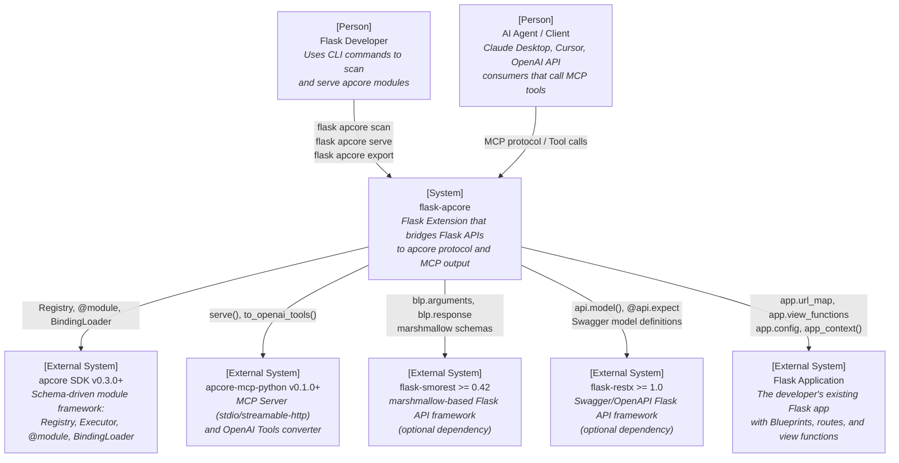

### 5.2 C4 Container Diagram

```mermaid
flowchart TB
    subgraph "AI Clients"
        ClaudeDesktop["[Container: Desktop App]<br/>Claude Desktop<br/><i>MCP client via stdio</i>"]
        Cursor["[Container: IDE]<br/>Cursor<br/><i>MCP client via stdio</i>"]
        OpenAIAPI["[Container: HTTP API]<br/>OpenAI-compatible API<br/><i>Tool calling consumer</i>"]
    end

    subgraph "flask-apcore Package"
        Extension["[Container: Python]<br/>flask_apcore.extension<br/><i>Flask Extension: init_app(), config,<br/>registry wrapper, auto-discovery</i>"]
        Scanners["[Container: Python]<br/>flask_apcore.scanners<br/><i>Native Flask, flask-smorest, flask-restx<br/>scanner adapters (optional deps)</i>"]
        SchemaEngine["[Container: Python]<br/>flask_apcore.schemas<br/><i>Multi-backend schema inference:<br/>Pydantic, marshmallow, type hints, YAML</i>"]
        OutputWriters["[Container: Python]<br/>flask_apcore.output<br/><i>YAML and Python code generators</i>"]
        CLI["[Container: Python]<br/>flask_apcore.cli<br/><i>Click CLI: flask apcore scan,<br/>serve, export</i>"]
        ContextBridge["[Container: Python]<br/>flask_apcore.context<br/><i>Flask request context to<br/>apcore Context bridge</i>"]
    end

    subgraph "apcore Ecosystem"
        ApcoreSDK["[Container: Python]<br/>apcore SDK v0.3.0+<br/><i>Registry, Executor, @module,<br/>BindingLoader, Context</i>"]
        ApcoreMCP["[Container: Python]<br/>apcore-mcp-python v0.1.0+<br/><i>serve() for MCP Server,<br/>to_openai_tools() for export</i>"]
    end

    subgraph "Flask Application (User's Project)"
        FlaskApp["[Container: Python]<br/>Flask App<br/><i>app factory, config, WSGI</i>"]
        Blueprints["[Container: Python]<br/>Flask Blueprints<br/><i>Route definitions,<br/>view functions</i>"]
        ModuleFiles["[Container: Files]<br/>apcore_modules/<br/><i>Generated YAML bindings<br/>and @module Python files</i>"]
    end

    ClaudeDesktop -->|"stdio MCP"| ApcoreMCP
    Cursor -->|"stdio MCP"| ApcoreMCP
    OpenAIAPI -->|"Tool definitions"| ApcoreMCP

    CLI -->|"Orchestrates"| Extension
    CLI -->|"Invokes"| Scanners
    CLI -->|"Invokes"| OutputWriters
    CLI -->|"Delegates serve()"| ApcoreMCP

    Extension -->|"Registry, BindingLoader"| ApcoreSDK
    Extension -->|"app.config, init_app()"| FlaskApp

    Scanners -->|"url_map, view_functions"| Blueprints
    Scanners -->|"Schema extraction"| SchemaEngine

    OutputWriters -->|"Writes"| ModuleFiles
    Extension -->|"Loads on startup"| ModuleFiles

    ContextBridge -->|"Context, Identity"| ApcoreSDK
    ApcoreMCP -->|"Registry"| ApcoreSDK
```

### 5.3 Component Breakdown

| Component | File(s) | Responsibility | Dependencies |
|-----------|---------|----------------|--------------|
| Flask Extension | `extension.py` | `init_app()`, config loading, auto-discovery lifecycle | Flask, apcore SDK |
| Configuration | `config.py` | `APCORE_*` config defaults, validation, typed dataclass | Flask |
| Registry Wrapper | `registry.py` | App-scoped singleton Registry/Executor, thread-safe access | apcore SDK |
| Context Bridge | `context.py` | Flask request/app context to apcore Context conversion | Flask, apcore SDK |
| CLI Commands | `cli.py` | Click command group: `scan`, `serve`, `export` | Click, Flask |
| Base Scanner | `scanners/base.py` | Abstract scanner interface, `ScannedModule` dataclass | -- |
| Native Scanner | `scanners/native.py` | Flask `url_map` + `view_functions` introspection | Flask |
| Smorest Scanner | `scanners/smorest.py` | flask-smorest marshmallow schema extraction | flask-smorest (optional) |
| Restx Scanner | `scanners/restx.py` | flask-restx Swagger model extraction | flask-restx (optional) |
| Schema Dispatcher | `schemas/__init__.py` | Multi-backend auto-detection and routing | -- |
| Pydantic Backend | `schemas/pydantic_backend.py` | Pydantic model to JSON Schema conversion | Pydantic |
| Marshmallow Backend | `schemas/marshmallow_backend.py` | marshmallow schema to JSON Schema conversion | marshmallow (optional) |
| Type Hints Backend | `schemas/typehints_backend.py` | Python type hints to JSON Schema conversion | -- |
| YAML Backend | `schemas/yaml_backend.py` | External YAML schema loading | PyYAML |
| YAML Writer | `output/yaml_writer.py` | Generate `.binding.yaml` files | PyYAML |
| Python Writer | `output/python_writer.py` | Generate `@module`-decorated Python files | -- |

---

## 6. Alternative Solutions

### 6.1 Key Decision 1: Overall Architecture Style

#### Option A: Thin Wrapper (Recommended)

flask-apcore acts as a minimal coordination layer. Each component delegates to an existing library:

- **Module registration** delegates to `apcore.Registry` and `apcore.BindingLoader`
- **Schema extraction** delegates to framework-specific introspection (marshmallow, flask-restx models)
- **MCP serving** delegates to `apcore_mcp.serve()`
- **OpenAI export** delegates to `apcore_mcp.to_openai_tools()`

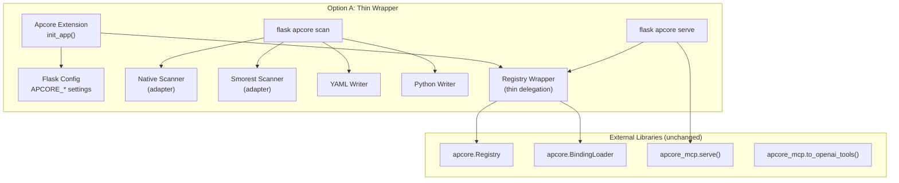

**Pros:**
- Minimal codebase (~2,000--2,500 lines), sustainable for a solo developer
- Validates the apcore protocol directly (stated project goal)
- Fastest path to MVP; most protocol logic already exists in dependencies
- Familiar Flask Extension pattern (like Flask-SQLAlchemy, Flask-Login)

**Cons:**
- Tightly coupled to apcore SDK API surface; breaking changes propagate
- Less control over error messages from apcore SDK internals
- Scanner output quality depends on Flask introspection completeness

#### Option B: Deep Integration

flask-apcore reimplements core apcore functionality natively using Flask patterns. Instead of delegating to `apcore.Registry`, it maintains its own registry backed by Flask `app.extensions`. The `@module` decorator is reimplemented with Flask-specific features (request injection, before/after hooks). The MCP server is built directly on the MCP Python SDK, bypassing apcore-mcp-python.

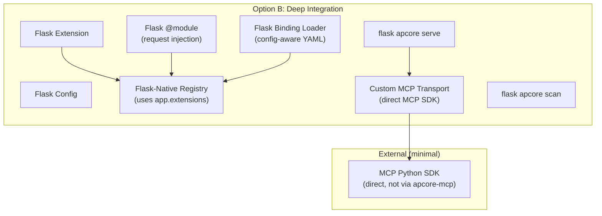

**Pros:**
- Full control over Flask-specific patterns (request context injection, before_request bridging)
- Not dependent on apcore SDK stability
- Deeper Flask integration may feel more "native" to purist Flask developers

**Cons:**
- Significantly larger codebase (~6,000--9,000 lines), unsustainable for solo developer
- Reimplements proven apcore SDK logic (duplicated effort, duplicated bugs)
- Diverges from apcore protocol -- modules are not portable across apcore implementations
- 3--4x longer time to MVP
- Does not validate the apcore protocol (the project's stated goal)

#### Option C: Plugin Architecture (Separate PyPI Packages)

flask-apcore is split into separate PyPI packages: `flask-apcore` (core), `flask-apcore-smorest`, `flask-apcore-restx`, `flask-apcore-mcp`. Each package has independent release cycles.

**Pros:**
- Maximum modularity; users install only what they need
- Independent release cadence per plugin

**Cons:**
- Over-engineering for an early-stage project with no community
- 4+ PyPI packages to maintain instead of 1
- Discovery problem worsens (users must find `flask-apcore-smorest` separately)
- Optional extras (`pip install flask-apcore[smorest]`) already solve dependency management

#### Comparison Matrix

| Criteria | A: Thin Wrapper | B: Deep Integration | C: Plugin Architecture |
|----------|-----------------|---------------------|------------------------|
| Codebase Size | **~2,000--2,500 lines** | ~6,000--9,000 lines | ~3,000 lines across 4 packages |
| Solo Developer Feasibility | **High** | Low | Medium |
| Time to MVP | **4--6 weeks** | 14--20 weeks | 8--10 weeks |
| Dependency on apcore SDK | High (by design) | Low | Medium |
| Flask-Native Feel | Medium-High | **High** | Medium |
| apcore Protocol Validation | **High** | Low | Medium |
| Maintenance Burden | **Low** | High | Medium-High |
| Discoverability | **Good** (single package) | Good | Poor (multiple packages) |

**Decision: Option A (Thin Wrapper).**

**Rationale:** Solo developer feasibility, protocol validation, and fastest path to market. The tight coupling to apcore SDK is accepted because the same developer controls both projects, and the coupling is intentional -- flask-apcore exists to be the Flask implementation of the apcore protocol.

### 6.2 Key Decision 2: WSGI/Async Bridging Strategy

#### Strategy A: Independent Process via CLI (Recommended)

The `flask apcore serve` Click command creates a Flask app context, populates the Registry, then launches an independent `asyncio.run()` event loop for the MCP server. Module functions execute via `asyncio.to_thread()` with the Flask application context explicitly pushed onto the thread.

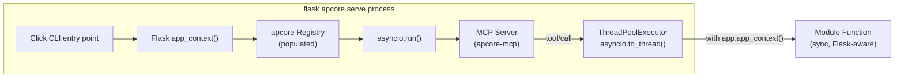

**Pros:**
- Clean separation: WSGI and asyncio never share the same event loop
- Flask app context is explicitly managed (no implicit state leakage)
- `asyncio.to_thread()` is a standard Python pattern with well-understood behavior
- Consistent with how django-apcore handles Django's sync ORM in async MCP contexts
- No additional dependencies (uses stdlib `asyncio` and `concurrent.futures`)

**Cons:**
- MCP server and Flask HTTP server are separate processes (cannot share in-flight request state)
- Thread pool has finite capacity; high-concurrency MCP calls may queue
- Each thread requires its own Flask application context push

#### Strategy B: Embedded Async Server via Background Thread

A background thread runs an asyncio event loop within the Flask WSGI process. The MCP server runs on this background loop. Module calls from MCP cross from the async loop to the WSGI main thread via a thread-safe queue.

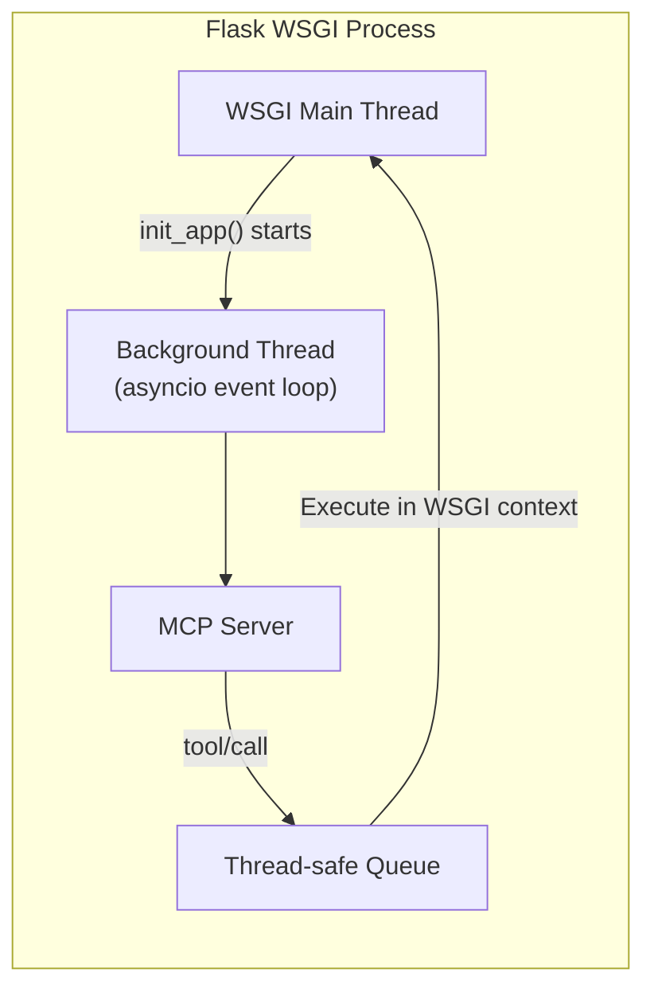

**Pros:**
- Single process; MCP and WSGI share memory (potentially useful for real-time state)
- MCP server starts automatically with the Flask app (no separate command)

**Cons:**
- Complex thread synchronization between asyncio loop and WSGI threads
- WSGI servers (gunicorn, waitress) may fork workers, duplicating the background thread unpredictably
- Debugging cross-thread state issues is significantly harder
- HTTP Streamable transport requires its own port, conflicting with the WSGI server's port
- Violates Flask's "micro" philosophy of simplicity

#### Strategy C: Subprocess with IPC

The `flask apcore serve` command spawns a child process for the MCP server. Communication between the Flask process and MCP process happens via IPC (Unix domain sockets or shared memory-mapped files).

**Pros:**
- Complete process isolation; no shared state concerns
- MCP server crash does not affect Flask

**Cons:**
- IPC serialization overhead for every module call
- Additional complexity of process management, signal handling, and cleanup
- Module functions cannot access Flask's in-process resources (database connections, caches) from the child process
- Significantly more code than Strategy A

#### Comparison Matrix

| Criteria | A: Independent Process | B: Embedded Thread | C: Subprocess + IPC |
|----------|----------------------|--------------------|--------------------|
| Architectural Complexity | **Low** | High | Medium-High |
| Flask App Context Access | **Yes** (pushed per thread) | Complex (cross-thread) | **No** (separate process) |
| WSGI Server Compatibility | **All** (gunicorn, waitress, etc.) | Fragile (worker forking issues) | All |
| Debugging Difficulty | **Low** | High | Medium |
| Startup UX | Separate command | Automatic | Separate command |
| Resource Sharing | In-process | In-process | IPC overhead |
| Implementation Effort | **~100 lines** | ~400 lines | ~600 lines |

**Decision: Strategy A (Independent Process via CLI).**

**Rationale:** Architectural simplicity, compatibility with all WSGI servers, and explicit Flask app context management. The "separate process" trade-off is accepted because it matches the standard MCP deployment model (Claude Desktop and Cursor both expect separate MCP server processes). The `flask apcore serve` command is the natural Flask CLI integration point.

### 6.3 Key Decision 3: Scanner Plugin Architecture

#### Approach A: Class-Based Plugin with Abstract Base (Recommended)

Scanners are Python classes extending `BaseScanner`. The scanner registry maps source names to scanner classes. Optional dependencies are checked at scanner instantiation time.

```python
class BaseScanner(ABC):
    @abstractmethod
    def scan(self, app: Flask, ...) -> list[ScannedModule]: ...
    @abstractmethod
    def get_source_name(self) -> str: ...

SCANNER_REGISTRY: dict[str, type[BaseScanner]] = {
    "native": NativeFlaskScanner,
    "smorest": SmorestScanner,  # Registered only if flask-smorest importable
    "restx": RestxScanner,      # Registered only if flask-restx importable
}
```

**Pros:**
- Simple, explicit, and debuggable
- Each scanner is a single file with clear responsibilities
- Optional dependency checking at registration time prevents import errors
- Consistent with django-apcore's proven scanner pattern

**Cons:**
- Adding third-party scanners requires modifying the registry (unless entry points are used)

#### Approach B: Entry Point-Based Plugin Discovery

Third-party packages register scanners via `pyproject.toml` entry points (`flask_apcore.scanners`). flask-apcore discovers them at runtime via `importlib.metadata.entry_points()`.

**Pros:**
- Third-party scanners can be installed without modifying flask-apcore code
- Maximum extensibility

**Cons:**
- Over-engineering for a project with no community yet
- Entry point discovery adds startup latency
- Harder to debug when plugins fail to load
- No third-party scanner authors exist today

**Decision: Approach A (Class-Based Plugin) for MVP.** Entry point discovery can be added in a future version if community-contributed scanners emerge. The abstract base class is designed to support either approach without breaking changes.

---

## 7. Detailed Component Design

### 7.1 Flask Extension (`extension.py`)

#### Responsibilities

- Provide the `Apcore` class following Flask's Extension pattern
- Support both direct initialization (`Apcore(app)`) and factory pattern (`apcore.init_app(app)`)
- Load and validate `APCORE_*` configuration from `app.config`
- Trigger auto-discovery of YAML bindings and `@module`-decorated functions
- Register the Click CLI command group
- Store the extension instance in `app.extensions["apcore"]`

#### Public API

```python
class Apcore:
    """Flask Extension for apcore AI-Perceivable Core integration.

    Usage (direct):
        app = Flask(__name__)
        apcore = Apcore(app)

    Usage (factory pattern):
        apcore = Apcore()

        def create_app():
            app = Flask(__name__)
            apcore.init_app(app)
            return app
    """

    def __init__(self, app: Flask | None = None) -> None:
        """Initialize the extension.

        Args:
            app: Flask application instance. If provided, init_app()
                 is called immediately.
        """

    def init_app(self, app: Flask) -> None:
        """Initialize the extension with a Flask application.

        This method:
        1. Validates APCORE_* configuration in app.config
        2. Creates the app-scoped Registry singleton
        3. Registers the Click CLI command group
        4. If APCORE_AUTO_DISCOVER is True:
           a. Loads YAML binding files from APCORE_MODULE_DIR
           b. Scans for @module-decorated functions in configured packages

        Args:
            app: Flask application instance.

        Raises:
            ValueError: If any APCORE_* config value is invalid.
        """

    def get_registry(self, app: Flask | None = None) -> Registry:
        """Return the apcore Registry for the given app.

        Args:
            app: Flask app instance. If None, uses current_app.

        Returns:
            The apcore Registry scoped to this app.
        """

    def get_executor(self, app: Flask | None = None) -> Executor:
        """Return the apcore Executor for the given app.

        Args:
            app: Flask app instance. If None, uses current_app.

        Returns:
            The apcore Executor scoped to this app.
        """
```

#### Internal Design

The extension stores per-app state in `app.extensions["apcore"]` as a dictionary containing:

```python
{
    "registry": Registry,       # Singleton apcore.Registry
    "executor": Executor | None,  # Lazily created when middleware/ACL configured
    "settings": ApcoreSettings,  # Validated config dataclass
}
```

This follows Flask's multi-app pattern: each Flask app gets its own Registry, enabling test isolation and multi-app deployments.

#### Auto-Discovery Flow

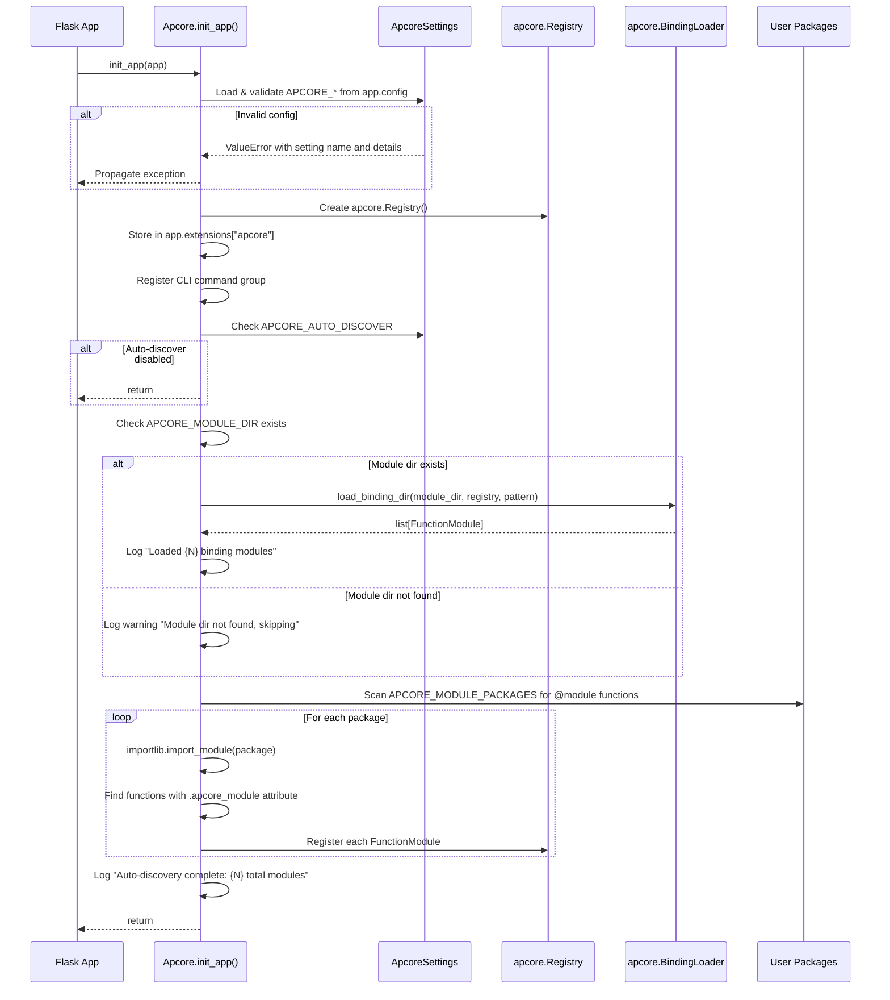

#### Error Handling

| Error Scenario | Exception | Message Format |
|---------------|-----------|---------------|
| Invalid `APCORE_MODULE_DIR` type | `ValueError` | `"APCORE_MODULE_DIR must be a string path. Got: {type}"` |
| Invalid `APCORE_SERVE_TRANSPORT` value | `ValueError` | `"APCORE_SERVE_TRANSPORT must be one of: stdio, streamable-http, sse. Got: '{value}'"` |
| `APCORE_SERVE_PORT` out of range | `ValueError` | `"APCORE_SERVE_PORT must be an integer between 1 and 65535. Got: {value}"` |
| Malformed YAML binding | `BindingFileInvalidError` | Propagated from apcore SDK with file path and parse error |
| `@module` function registration failure | Logged as WARNING | `"Failed to register module from {package}.{attr}: {error}"` |
| Module dir not found | Logged as WARNING | `"Module directory not found: {path}. Skipping auto-discovery."` |

### 7.2 Configuration (`config.py`)

#### Responsibilities

- Define default values for all `APCORE_*` settings
- Read settings from `app.config` with defaults
- Validate types, value ranges, and mutual consistency
- Expose validated settings as a frozen dataclass

#### Public API

```python
# Defaults
DEFAULT_MODULE_DIR = "apcore_modules/"
DEFAULT_AUTO_DISCOVER = True
DEFAULT_SERVE_TRANSPORT = "stdio"
DEFAULT_SERVE_HOST = "127.0.0.1"
DEFAULT_SERVE_PORT = 9100
DEFAULT_SERVER_NAME = "apcore-mcp"
DEFAULT_BINDING_PATTERN = "*.binding.yaml"
DEFAULT_SCANNER_SOURCE = "auto"

VALID_TRANSPORTS = ("stdio", "streamable-http", "sse")
VALID_SCANNER_SOURCES = ("auto", "native", "smorest", "restx")


@dataclass(frozen=True)
class ApcoreSettings:
    """Validated APCORE_* settings."""
    module_dir: str
    auto_discover: bool
    serve_transport: str
    serve_host: str
    serve_port: int
    server_name: str
    binding_pattern: str
    scanner_source: str
    module_packages: list[str]
    middlewares: list[str]
    acl_path: str | None
    context_factory: str | None
    server_version: str | None
    executor_config: dict | None
    observability_logging: bool
    tracing: bool | dict | None
    metrics: bool | dict | None


def load_settings(app: Flask) -> ApcoreSettings:
    """Read and validate APCORE_* settings from app.config.

    Args:
        app: Flask application instance.

    Returns:
        Validated ApcoreSettings dataclass.

    Raises:
        ValueError: If any setting is invalid.
    """
```

#### Validation Rules

| Setting | Type | Default | Valid Values | Error Message |
|---------|------|---------|-------------|---------------|
| `APCORE_MODULE_DIR` | `str` | `"apcore_modules/"` | Any string path | `"APCORE_MODULE_DIR must be a string path. Got: {type}"` |
| `APCORE_AUTO_DISCOVER` | `bool` | `True` | `True`, `False` | `"APCORE_AUTO_DISCOVER must be a boolean. Got: {type}"` |
| `APCORE_SERVE_TRANSPORT` | `str` | `"stdio"` | `"stdio"`, `"streamable-http"`, `"sse"` | `"APCORE_SERVE_TRANSPORT must be one of: stdio, streamable-http, sse. Got: '{value}'"` |
| `APCORE_SERVE_HOST` | `str` | `"127.0.0.1"` | Valid IP or hostname | `"APCORE_SERVE_HOST must be a string. Got: {type}"` |
| `APCORE_SERVE_PORT` | `int` | `9100` | 1--65535 | `"APCORE_SERVE_PORT must be an integer between 1 and 65535. Got: {value}"` |
| `APCORE_SERVER_NAME` | `str` | `"apcore-mcp"` | 1--100 chars | `"APCORE_SERVER_NAME must be a non-empty string up to 100 characters."` |
| `APCORE_BINDING_PATTERN` | `str` | `"*.binding.yaml"` | Valid glob pattern | `"APCORE_BINDING_PATTERN must be a valid glob pattern string."` |
| `APCORE_SCANNER_SOURCE` | `str` | `"auto"` | `"auto"`, `"native"`, `"smorest"`, `"restx"` | `"APCORE_SCANNER_SOURCE must be one of: auto, native, smorest, restx. Got: '{value}'"` |
| `APCORE_MODULE_PACKAGES` | `list[str]` | `[]` | List of dotted paths | `"APCORE_MODULE_PACKAGES must be a list of dotted path strings."` |
| `APCORE_MIDDLEWARES` | `list[str]` | `[]` | List of dotted paths | `"APCORE_MIDDLEWARES must be a list of dotted path strings."` |
| `APCORE_ACL_PATH` | `str\|None` | `None` | String path or None | `"APCORE_ACL_PATH must be a string path. Got: {type}"` |
| `APCORE_CONTEXT_FACTORY` | `str\|None` | `None` | Dotted path or None | `"APCORE_CONTEXT_FACTORY must be a dotted path string. Got: {type}"` |
| `APCORE_SERVER_VERSION` | `str\|None` | `None` | Non-empty string or None | `"APCORE_SERVER_VERSION must be a non-empty string if set."` |
| `APCORE_OBSERVABILITY_LOGGING` | `bool` | `False` | `True`, `False` | `"APCORE_OBSERVABILITY_LOGGING must be a boolean. Got: {type}"` |

**Type Coercion Rules:**
- String settings: must be `str` type; no coercion from other types
- Boolean settings: must be Python `bool`; strings like `"true"` are rejected
- Integer settings: must be Python `int`; `float` values are rejected; `bool` subclass of `int` is rejected via `isinstance(value, bool)` guard
- List settings: must be Python `list` with all elements being `str`
- `None` values for settings with defaults are treated as "use default"

### 7.3 Registry Wrapper (`registry.py`)

#### Responsibilities

- Provide app-scoped access to the singleton `apcore.Registry`
- Provide lazy `apcore.Executor` creation when middleware/ACL is configured
- Provide context factory resolution
- Thread-safe singleton creation

#### Public API

```python
def get_registry(app: Flask | None = None) -> Registry:
    """Return the apcore Registry for the current Flask app.

    The registry is stored in app.extensions["apcore"]["registry"].
    If no app is provided, uses flask.current_app.

    Args:
        app: Flask app instance, or None to use current_app.

    Returns:
        The apcore Registry scoped to this app.

    Raises:
        RuntimeError: If called outside application context and no app provided.
    """


def get_executor(app: Flask | None = None) -> Executor:
    """Return the apcore Executor for the current Flask app.

    Lazily created on first call. Configured from APCORE_MIDDLEWARES,
    APCORE_ACL_PATH, and APCORE_EXECUTOR_CONFIG settings.

    Args:
        app: Flask app instance, or None to use current_app.

    Returns:
        The apcore Executor scoped to this app.
    """


def get_context_factory(app: Flask | None = None) -> ContextFactory:
    """Return the ContextFactory for the current Flask app.

    Resolves from APCORE_CONTEXT_FACTORY setting if configured,
    otherwise returns the built-in FlaskContextFactory.

    Args:
        app: Flask app instance, or None to use current_app.

    Returns:
        A ContextFactory instance.
    """
```

#### Internal Design

Unlike django-apcore's module-level singletons with `threading.Lock`, flask-apcore stores state per-app in `app.extensions["apcore"]`. This is the Flask-idiomatic approach and enables:
- Multiple Flask apps with separate registries (testing, multi-tenant)
- Clean teardown between test cases
- No global mutable state

```python
def get_registry(app: Flask | None = None) -> Registry:
    if app is None:
        app = current_app._get_current_object()
    ext_data = app.extensions.get("apcore")
    if ext_data is None:
        raise RuntimeError(
            "flask-apcore not initialized. Call Apcore(app) or apcore.init_app(app) first."
        )
    return ext_data["registry"]
```

### 7.4 Context Bridge (`context.py`)

#### Responsibilities

- Convert Flask request context (`request`, `g`, `session`) into apcore `Context`
- Extract user identity for ACL purposes
- Provide application context to module execution in MCP serve mode

#### Public API

```python
class FlaskContextFactory:
    """Creates apcore Context from Flask request context.

    Implements the apcore ContextFactory protocol:
        create_context(request) -> Context
    """

    def create_context(self, request: Request | None = None) -> Context:
        """Create an apcore Context from Flask request context.

        If request is None (MCP serve mode where there is no HTTP request),
        creates an anonymous Context.

        Args:
            request: Flask Request object, or None for MCP-originated calls.

        Returns:
            apcore Context with Identity derived from request if available.
        """

    def _extract_identity(self, request: Request) -> Identity:
        """Extract an apcore Identity from a Flask request.

        Checks for:
        1. flask_login current_user (if flask-login installed)
        2. g.user (common Flask pattern)
        3. request.authorization (HTTP Basic/Bearer)
        4. Falls back to anonymous identity

        Args:
            request: Flask Request object.

        Returns:
            apcore Identity with user info, or anonymous identity.
        """


def push_app_context_for_module(app: Flask) -> Callable:
    """Create a wrapper that pushes Flask app context before module execution.

    Used by the WSGI/async bridge to ensure module functions can
    access current_app, g, and database connections when called
    from the MCP server's asyncio event loop via asyncio.to_thread().

    Args:
        app: Flask application instance.

    Returns:
        A decorator function that wraps module execution with app_context.
    """
```

#### Identity Extraction Logic

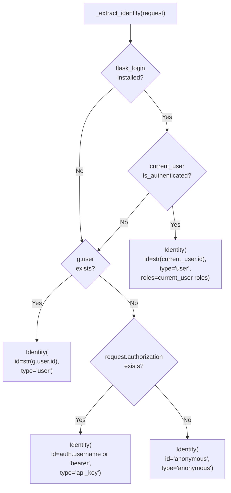

### 7.5 Scanner System

#### 7.5.1 Base Scanner (`scanners/base.py`)

```python
@dataclass
class ScannedModule:
    """Result of scanning a single Flask endpoint.

    Attributes:
        module_id: Unique module identifier (e.g., 'users.get_user').
        description: Human-readable description for MCP tool listing.
        input_schema: JSON Schema dict for module input.
        output_schema: JSON Schema dict for module output.
        tags: Categorization tags (often derived from Blueprint name).
        target: Callable reference in 'module.path:callable' format.
        http_method: HTTP method (GET, POST, etc.).
        url_rule: The Flask URL rule string.
        version: Module version string.
        warnings: Non-fatal issues encountered during scanning.
    """
    module_id: str
    description: str
    input_schema: dict[str, Any]
    output_schema: dict[str, Any]
    tags: list[str]
    target: str
    http_method: str
    url_rule: str
    version: str = "1.0.0"
    warnings: list[str] = field(default_factory=list)


class BaseScanner(ABC):
    """Abstract base class for all Flask scanners.

    Subclasses must implement scan() and get_source_name().
    """

    @abstractmethod
    def scan(
        self,
        app: Flask,
        include: str | None = None,
        exclude: str | None = None,
    ) -> list[ScannedModule]:
        """Scan Flask app endpoints and return module definitions.

        Args:
            app: Flask application instance (with app context active).
            include: Regex pattern to include (matches against module_id).
            exclude: Regex pattern to exclude (matches against module_id).

        Returns:
            List of ScannedModule instances.
        """
        ...

    @abstractmethod
    def get_source_name(self) -> str:
        """Return human-readable scanner name (e.g., 'native-flask')."""
        ...

    def filter_modules(
        self,
        modules: list[ScannedModule],
        include: str | None = None,
        exclude: str | None = None,
    ) -> list[ScannedModule]:
        """Apply include/exclude regex filters to scanned modules.

        Args:
            modules: List of ScannedModule instances to filter.
            include: If set, only modules whose module_id matches are kept.
            exclude: If set, modules whose module_id matches are removed.

        Returns:
            Filtered list of ScannedModule instances.
        """

    def _deduplicate_ids(self, modules: list[ScannedModule]) -> list[ScannedModule]:
        """Resolve duplicate module IDs by appending _2, _3, etc."""

    def _is_api_route(self, rule: Rule, view_func: Callable) -> bool:
        """Determine if a Flask route is likely an API endpoint.

        Returns True if the route is NOT:
        - A static file route
        - A route that returns a render_template() call (heuristic)
        - A route explicitly excluded by configuration

        This is a heuristic filter; imprecise but useful for Lite Mode.
        """
```

#### 7.5.2 Native Flask Scanner (`scanners/native.py`)

```python
class NativeFlaskScanner(BaseScanner):
    """Scans native Flask routes via app.url_map and app.view_functions.

    This scanner provides baseline schema inference using Python type hints
    and function signatures. It does not require any Flask API framework.
    """

    def scan(
        self,
        app: Flask,
        include: str | None = None,
        exclude: str | None = None,
    ) -> list[ScannedModule]:
        """Scan all Flask routes and generate module definitions.

        For each route:
        1. Skip static file routes and template-rendering routes
        2. Extract function signature type hints
        3. Extract URL path parameters with types from converters
        4. Infer input_schema via schema inference engine
        5. Infer output_schema from return type annotation
        6. Extract description from docstring
        7. Generate module_id from Blueprint name + function name + method

        Args:
            app: Flask application with active application context.
            include: Regex pattern for module_id inclusion.
            exclude: Regex pattern for module_id exclusion.

        Returns:
            List of ScannedModule instances.
        """

    def get_source_name(self) -> str:
        return "native-flask"
```

**Module ID Generation Rules:**

| Rule | Input | Output | Example |
|------|-------|--------|---------|
| Blueprint route | Blueprint name + function name + HTTP method | `{blueprint}.{function}.{method}` | `users.get_user.get` |
| Non-Blueprint route | Function name + HTTP method | `{function}.{method}` | `index.get` |
| Collision resolution | Append `_2`, `_3` | `users.get_user.get_2` | -- |
| Special characters | Replace non-alphanumeric (except `.`) with `_` | `api_v1.users.get` | `/api/v1/users` |

**URL Converter to Type Mapping:**

| Flask Converter | Python Type | JSON Schema Type |
|----------------|-------------|-----------------|
| `int` | `int` | `{"type": "integer"}` |
| `float` | `float` | `{"type": "number"}` |
| `string` (default) | `str` | `{"type": "string"}` |
| `uuid` | `str` | `{"type": "string", "format": "uuid"}` |
| `path` | `str` | `{"type": "string"}` |

#### Scanner Scan Flow (Native)

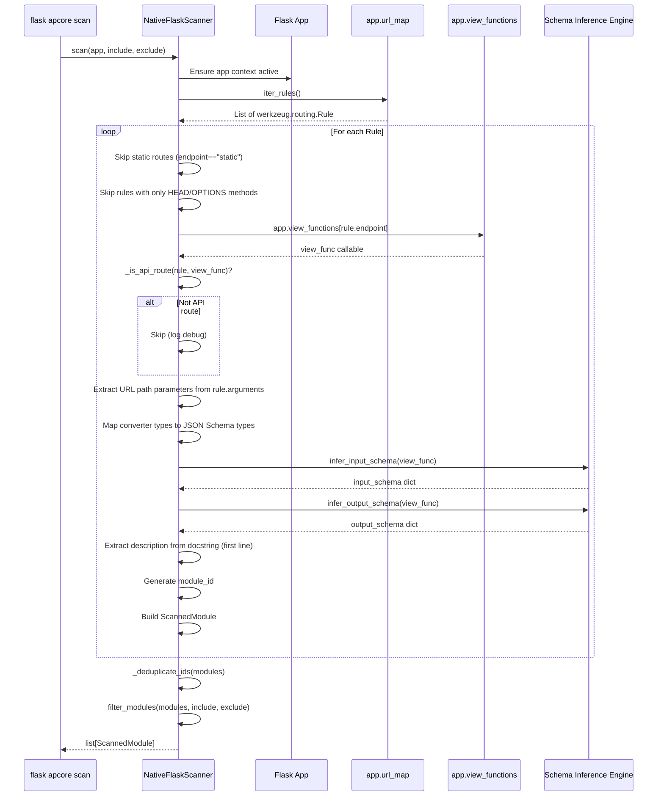

#### 7.5.3 flask-smorest Scanner (`scanners/smorest.py`)

```python
class SmorestScanner(BaseScanner):
    """Scans flask-smorest Blueprint routes.

    Extracts marshmallow schemas from @blp.arguments() and @blp.response()
    decorators. Requires flask-smorest >= 0.42.
    """

    def scan(
        self,
        app: Flask,
        include: str | None = None,
        exclude: str | None = None,
    ) -> list[ScannedModule]:
        """Scan flask-smorest Blueprints for marshmallow-schema-rich routes.

        For each flask-smorest Blueprint:
        1. Extract all registered routes
        2. For each route, extract marshmallow schemas from arguments/response decorators
        3. Convert marshmallow schemas to JSON Schema via marshmallow backend
        4. Extract OpenAPI description if available

        Raises:
            ImportError: If flask-smorest is not installed.
        """

    def get_source_name(self) -> str:
        return "flask-smorest"

    def _extract_marshmallow_schemas(
        self, view_func: Callable
    ) -> tuple[dict[str, Any], dict[str, Any]]:
        """Extract input/output marshmallow schemas from smorest decorators.

        Inspects view_func for _apidoc attribute set by flask-smorest
        decorators (@blp.arguments, @blp.response).

        Returns:
            Tuple of (input_schema_dict, output_schema_dict).
        """
```

**Marshmallow Schema Extraction Logic:**

flask-smorest stores API documentation metadata on view functions via the `_apidoc` attribute. The scanner extracts:

1. `view_func._apidoc.get("arguments")` -- list of `{"schema": MarshmallowSchema, "location": "json"|"query"|...}`
2. `view_func._apidoc.get("response", {}).get("schema")` -- the response marshmallow schema

#### 7.5.4 flask-restx Scanner (`scanners/restx.py`)

```python
class RestxScanner(BaseScanner):
    """Scans flask-restx Namespace routes.

    Extracts api.model() definitions and @api.expect()/@api.marshal_with()
    decorators. Requires flask-restx >= 1.0.
    """

    def scan(
        self,
        app: Flask,
        include: str | None = None,
        exclude: str | None = None,
    ) -> list[ScannedModule]:
        """Scan flask-restx Api instances for Swagger-documented routes.

        For each flask-restx Api registered on the app:
        1. Access api.__schema__ (Swagger/OpenAPI spec)
        2. Iterate over paths and operations
        3. Extract request/response models from components
        4. Convert to JSON Schema

        Raises:
            ImportError: If flask-restx is not installed.
        """

    def get_source_name(self) -> str:
        return "flask-restx"
```

#### 7.5.5 Scanner Registry

```python
def get_scanner(source: str) -> BaseScanner:
    """Return a scanner instance for the given source name.

    Args:
        source: Scanner source name ("native", "smorest", "restx", "auto").

    Returns:
        An instantiated BaseScanner subclass.

    Raises:
        ValueError: If source is unknown.
        ImportError: If required optional dependency is missing.
    """

def auto_detect_scanner(app: Flask) -> BaseScanner:
    """Auto-detect the best scanner for the given Flask app.

    Detection priority:
    1. If flask-smorest Blueprints are registered -> SmorestScanner
    2. If flask-restx Api instances are found -> RestxScanner
    3. Fallback -> NativeFlaskScanner

    Args:
        app: Flask application instance.

    Returns:
        The most appropriate scanner for the app.
    """
```

**Auto-Detection Algorithm:**

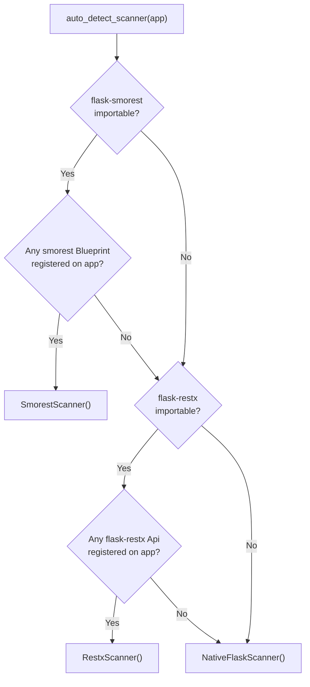

### 7.6 Output Writers

#### 7.6.1 YAML Writer (`output/yaml_writer.py`)

```python
class YAMLWriter:
    """Generates .binding.yaml files compatible with apcore.BindingLoader."""

    def write(
        self,
        modules: list[ScannedModule],
        output_dir: str,
        group_by: str = "individual",
    ) -> list[str]:
        """Write ScannedModule instances as YAML binding files.

        Args:
            modules: List of ScannedModule instances to write.
            output_dir: Directory path to write files into. Created if missing.
            group_by: "individual" (one file per module) or "blueprint"
                      (one file per Blueprint/tag group).

        Returns:
            List of file paths written.

        Raises:
            OSError: If output_dir is not writable.
        """

    def format_binding(self, module: ScannedModule) -> dict:
        """Convert a ScannedModule to the apcore binding dict format.

        Returns:
            Dict compatible with apcore BindingLoader YAML format.
        """
```

**Generated YAML Format:**

```yaml
# Auto-generated by flask-apcore scanner
# Source: native-flask
# Generated: 2026-02-21T10:30:00Z
# Do not edit manually unless you intend to customize.

bindings:
  - module_id: "users.get_user.get"
    target: "myapp.views:get_user"
    description: "Get a user by ID."
    tags:
      - "users"
    version: "1.0.0"
    input_schema:
      type: object
      properties:
        user_id:
          type: integer
          description: "User ID from URL path"
      required:
        - user_id
    output_schema:
      type: object
      properties:
        id:
          type: integer
        name:
          type: string
        email:
          type: string
      required:
        - id
        - name
        - email
```

#### 7.6.2 Python Writer (`output/python_writer.py`)

```python
class PythonWriter:
    """Generates Python files with @module-decorated wrapper functions."""

    def write(
        self,
        modules: list[ScannedModule],
        output_dir: str,
    ) -> list[str]:
        """Write ScannedModule instances as Python @module files.

        Args:
            modules: List of ScannedModule instances to write.
            output_dir: Directory path to write files into. Created if missing.

        Returns:
            List of file paths written.

        Raises:
            OSError: If output_dir is not writable.
        """

    def format_module(self, module: ScannedModule) -> str:
        """Convert a ScannedModule to Python source code with @module decorator.

        Generated code:
        1. Inline Pydantic models for input/output schemas
        2. @module decorated function that delegates to the original callable
        3. PEP 8 compliant formatting

        Returns:
            Python source code string.
        """
```

---

## 8. CLI Design

### 8.1 Command Group Structure

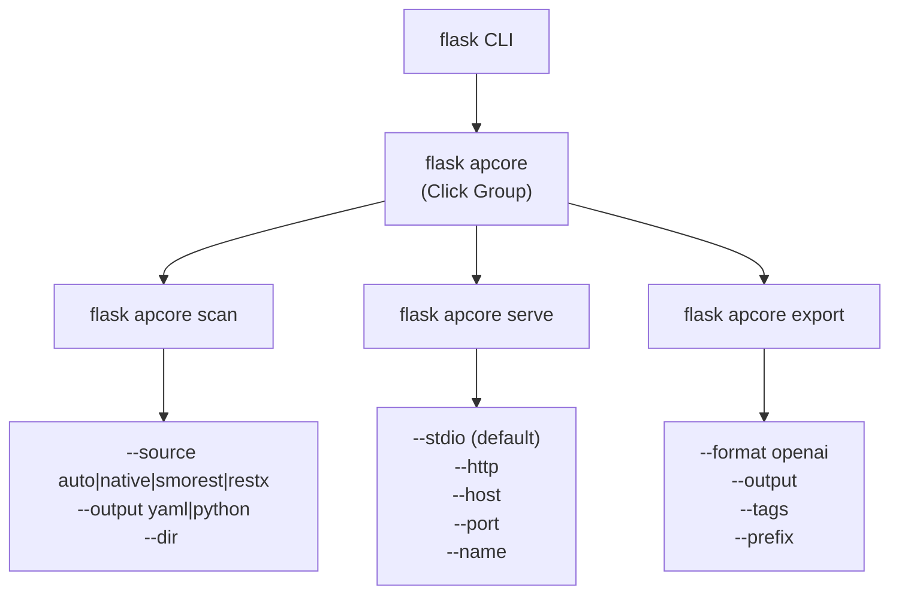

### 8.2 `flask apcore scan`

```python
@apcore_cli.command("scan")
@click.option(
    "--source", "-s",
    type=click.Choice(["auto", "native", "smorest", "restx"]),
    default="auto",
    help="Scanner source. 'auto' detects the best scanner.",
)
@click.option(
    "--output", "-o",
    type=click.Choice(["yaml", "python"]),
    default="yaml",
    help="Output format for generated module definitions.",
)
@click.option(
    "--dir", "-d",
    type=click.Path(),
    default=None,
    help="Output directory. Defaults to APCORE_MODULE_DIR config.",
)
@click.option(
    "--dry-run",
    is_flag=True,
    default=False,
    help="Preview output without writing files.",
)
@click.option(
    "--include",
    type=str,
    default=None,
    help="Regex pattern: only include matching module IDs.",
)
@click.option(
    "--exclude",
    type=str,
    default=None,
    help="Regex pattern: exclude matching module IDs.",
)
@click.option(
    "--validate",
    is_flag=True,
    default=False,
    help="Validate generated schemas against apcore spec.",
)
@with_appcontext
def scan_command(source, output, dir, dry_run, include, exclude, validate):
    """Scan Flask routes and generate apcore module definitions."""
```

**Validation Rules:**

| Parameter | Validation | Error Behavior |
|-----------|-----------|---------------|
| `--source` | Must be one of the Click.Choice values | Click rejects invalid values before handler runs |
| `--output` | Must be `"yaml"` or `"python"` | Click rejects invalid values |
| `--dir` | If provided, parent directory must exist | `click.ClickException("Output directory parent '{path}' does not exist")` |
| `--include` | Must be a valid regex | `click.ClickException("Invalid --include pattern: '{pattern}'. {regex_error}")` |
| `--exclude` | Must be a valid regex | `click.ClickException("Invalid --exclude pattern: '{pattern}'. {regex_error}")` |
| `--source smorest` without flask-smorest installed | Import check | `click.ClickException("flask-smorest is required for --source smorest. Install: pip install flask-apcore[smorest]")` |
| `--source restx` without flask-restx installed | Import check | `click.ClickException("flask-restx is required for --source restx. Install: pip install flask-apcore[restx]")` |

**Output:**

```
[flask-apcore] Scanning native-flask routes...
[flask-apcore] Found 15 API routes (skipped 3 template routes).
[flask-apcore] Generated 15 module definitions.
[flask-apcore] Written 15 files to apcore_modules/
[flask-apcore]   - apcore_modules/users.get_user.get.binding.yaml
[flask-apcore]   - apcore_modules/users.create_user.post.binding.yaml
[flask-apcore]   ...
[flask-apcore] Warnings: 2
[flask-apcore]   - Route 'GET /health' has no type hints (input_schema is empty)
[flask-apcore]   - Route 'POST /upload' has no docstring (description is auto-generated)
```

**Exit Codes:**

| Code | Meaning |
|------|---------|
| 0 | Success (routes found, even with warnings) |
| 1 | No routes found or error occurred |

### 8.3 `flask apcore serve`

```python
@apcore_cli.command("serve")
@click.option(
    "--stdio",
    "transport",
    flag_value="stdio",
    default=True,
    help="Use stdio transport (default).",
)
@click.option(
    "--http",
    "transport",
    flag_value="streamable-http",
    help="Use HTTP Streamable transport.",
)
@click.option(
    "--host",
    type=str,
    default=None,
    help="Host for HTTP transport. Default: APCORE_SERVE_HOST config.",
)
@click.option(
    "--port", "-p",
    type=int,
    default=None,
    help="Port for HTTP transport. Default: APCORE_SERVE_PORT config.",
)
@click.option(
    "--name",
    type=str,
    default=None,
    help="MCP server name. Default: APCORE_SERVER_NAME config.",
)
@with_appcontext
def serve_command(transport, host, port, name):
    """Start an MCP server exposing registered apcore modules as tools."""
```

**Serve Flow (Detailed):**

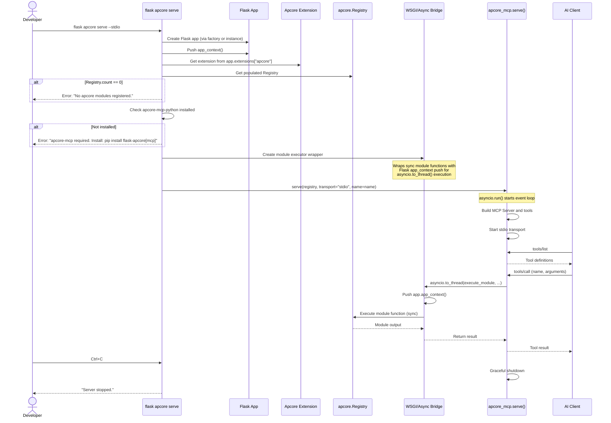

### 8.4 `flask apcore export`

```python
@apcore_cli.command("export")
@click.option(
    "--format", "-f",
    "export_format",
    type=click.Choice(["openai"]),
    default="openai",
    help="Export format.",
)
@click.option(
    "--output", "-o",
    type=click.Path(),
    default=None,
    help="Output file path. Default: stdout.",
)
@click.option(
    "--tags",
    type=str,
    default=None,
    help="Comma-separated tags to filter modules.",
)
@click.option(
    "--prefix",
    type=str,
    default=None,
    help="Module ID prefix to filter.",
)
@with_appcontext
def export_command(export_format, output, tags, prefix):
    """Export registered modules as tool definitions."""
```

---

## 9. Schema Inference Engine

### 9.1 Architecture

The schema inference engine is a multi-backend system that auto-detects the best available schema source for each route and converts it to JSON Schema.

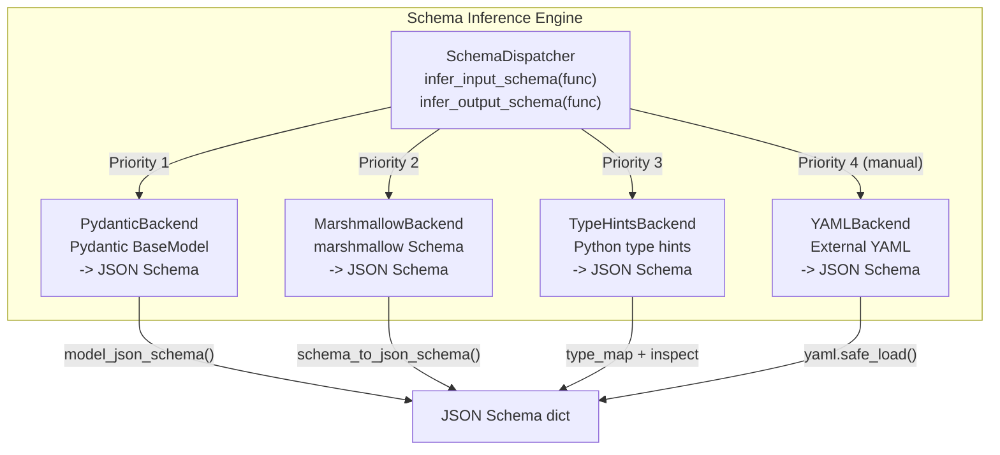

### 9.2 Detection Logic

```python
class SchemaDispatcher:
    """Routes schema inference to the best available backend.

    Detection precedence for input_schema:
    1. Pydantic: function has Pydantic BaseModel-typed parameters
    2. Marshmallow: function has marshmallow Schema associated (via smorest decorator)
    3. Type hints: function has standard Python type annotations
    4. Fallback: empty schema with extra="allow"

    Detection precedence for output_schema:
    1. Pydantic: function return type is a Pydantic BaseModel
    2. Marshmallow: function has marshmallow response schema (via smorest decorator)
    3. Type hints: function has return type annotation
    4. Fallback: permissive schema
    """

    def __init__(self) -> None:
        self._backends: list[SchemaBackend] = []
        self._register_available_backends()

    def _register_available_backends(self) -> None:
        """Register backends based on available imports."""
        # Always available
        self._backends.append(PydanticBackend())
        self._backends.append(TypeHintsBackend())

        # Optional
        try:
            import marshmallow
            self._backends.insert(1, MarshmallowBackend())
        except ImportError:
            pass

    def infer_input_schema(
        self,
        func: Callable,
        url_params: dict[str, str] | None = None,
        extra_context: dict[str, Any] | None = None,
    ) -> dict[str, Any]:
        """Infer JSON Schema for a function's input.

        Args:
            func: The view function to analyze.
            url_params: URL path parameters with their types (from Flask converter).
            extra_context: Additional context (e.g., marshmallow schema from smorest).

        Returns:
            JSON Schema dict for the function's input.
        """

    def infer_output_schema(
        self,
        func: Callable,
        extra_context: dict[str, Any] | None = None,
    ) -> dict[str, Any]:
        """Infer JSON Schema for a function's output.

        Args:
            func: The view function to analyze.
            extra_context: Additional context (e.g., marshmallow response schema).

        Returns:
            JSON Schema dict for the function's output.
        """
```

### 9.3 Backend Implementations

#### 9.3.1 Pydantic Backend

```python
class PydanticBackend(SchemaBackend):
    """Converts Pydantic BaseModel to JSON Schema.

    Detection: Checks if function parameters have Pydantic BaseModel type hints
    or if the return type is a Pydantic BaseModel subclass.
    """

    def can_handle_input(self, func: Callable, context: dict | None = None) -> bool:
        """Return True if any parameter type is a Pydantic BaseModel subclass."""
        hints = typing.get_type_hints(func, include_extras=True)
        return any(
            isinstance(hint, type) and issubclass(hint, BaseModel)
            for name, hint in hints.items()
            if name != "return" and name not in ("self", "cls")
        )

    def infer_input(
        self, func: Callable, url_params: dict[str, str] | None = None, context: dict | None = None
    ) -> dict[str, Any]:
        """Extract JSON Schema from Pydantic-typed parameters.

        If a single Pydantic model parameter exists, its schema IS the input_schema.
        If multiple exist, they are merged into a single schema.
        URL parameters are added as additional required properties.
        """
        hints = typing.get_type_hints(func, include_extras=True)
        schema = {"type": "object", "properties": {}, "required": []}

        for name, hint in hints.items():
            if name == "return" or name in ("self", "cls"):
                continue
            if isinstance(hint, type) and issubclass(hint, BaseModel):
                model_schema = hint.model_json_schema()
                schema["properties"].update(model_schema.get("properties", {}))
                schema["required"].extend(model_schema.get("required", []))

        # Add URL parameters
        if url_params:
            for param_name, param_type in url_params.items():
                schema["properties"][param_name] = _flask_type_to_json_schema(param_type)
                if param_name not in schema["required"]:
                    schema["required"].append(param_name)

        return schema

    def can_handle_output(self, func: Callable, context: dict | None = None) -> bool:
        """Return True if return type is a Pydantic BaseModel subclass."""
        hints = typing.get_type_hints(func, include_extras=True)
        return_type = hints.get("return")
        return return_type is not None and isinstance(return_type, type) and issubclass(return_type, BaseModel)

    def infer_output(self, func: Callable, context: dict | None = None) -> dict[str, Any]:
        """Extract JSON Schema from Pydantic return type."""
        hints = typing.get_type_hints(func, include_extras=True)
        return_type = hints["return"]
        return return_type.model_json_schema()
```

#### 9.3.2 Marshmallow Backend

```python
class MarshmallowBackend(SchemaBackend):
    """Converts marshmallow Schema to JSON Schema.

    Used primarily with flask-smorest, where marshmallow schemas are
    attached to view functions via @blp.arguments() and @blp.response().
    """

    def can_handle_input(self, func: Callable, context: dict | None = None) -> bool:
        """Return True if context contains a marshmallow input schema."""
        return context is not None and "marshmallow_input" in context

    def infer_input(
        self, func: Callable, url_params: dict[str, str] | None = None, context: dict | None = None
    ) -> dict[str, Any]:
        """Convert marshmallow Schema to JSON Schema.

        Uses marshmallow's field type mapping:
        - fields.String -> {"type": "string"}
        - fields.Integer -> {"type": "integer"}
        - fields.Float -> {"type": "number"}
        - fields.Boolean -> {"type": "boolean"}
        - fields.List -> {"type": "array", "items": ...}
        - fields.Nested -> recursive conversion
        - fields.DateTime -> {"type": "string", "format": "date-time"}
        """

    def _marshmallow_field_to_json_schema(self, field: marshmallow.fields.Field) -> dict[str, Any]:
        """Convert a single marshmallow field to a JSON Schema property."""
```

**Marshmallow Field Type Mapping:**

| Marshmallow Field | JSON Schema | Notes |
|-------------------|-------------|-------|
| `fields.String` | `{"type": "string"}` | Includes `validate.Length` as `minLength`/`maxLength` |
| `fields.Integer` | `{"type": "integer"}` | Includes `validate.Range` as `minimum`/`maximum` |
| `fields.Float` | `{"type": "number"}` | -- |
| `fields.Boolean` | `{"type": "boolean"}` | -- |
| `fields.List` | `{"type": "array", "items": {...}}` | Recursively converts inner type |
| `fields.Nested` | Recursive schema | Converts nested marshmallow Schema |
| `fields.DateTime` | `{"type": "string", "format": "date-time"}` | -- |
| `fields.Date` | `{"type": "string", "format": "date"}` | -- |
| `fields.UUID` | `{"type": "string", "format": "uuid"}` | -- |
| `fields.Email` | `{"type": "string", "format": "email"}` | -- |
| `fields.Enum` | `{"type": "string", "enum": [...]}` | Extracts enum values |
| Other/Unknown | `{"type": "string"}` | Graceful fallback with warning |

#### 9.3.3 Type Hints Backend

```python
class TypeHintsBackend(SchemaBackend):
    """Converts Python type hints to JSON Schema.

    This is the fallback backend for native Flask routes that have
    type annotations but no Pydantic or marshmallow schemas.
    """

    def can_handle_input(self, func: Callable, context: dict | None = None) -> bool:
        """Return True if function has any typed parameters (other than Pydantic models)."""
        hints = typing.get_type_hints(func, include_extras=True)
        return any(
            name not in ("return", "self", "cls") and hint is not inspect.Parameter.empty
            for name, hint in hints.items()
        )

    def infer_input(
        self, func: Callable, url_params: dict[str, str] | None = None, context: dict | None = None
    ) -> dict[str, Any]:
        """Convert function parameter type hints to JSON Schema.

        Type mapping:
        - str -> {"type": "string"}
        - int -> {"type": "integer"}
        - float -> {"type": "number"}
        - bool -> {"type": "boolean"}
        - list[T] -> {"type": "array", "items": {T schema}}
        - dict[str, T] -> {"type": "object"}
        - Optional[T] -> schema for T with default null
        - T | None -> same as Optional[T]
        - Any unresolvable type -> {"type": "string"} with warning
        """
```

**Python Type to JSON Schema Mapping:**

| Python Type | JSON Schema | Notes |
|-------------|-------------|-------|
| `str` | `{"type": "string"}` | -- |
| `int` | `{"type": "integer"}` | -- |
| `float` | `{"type": "number"}` | -- |
| `bool` | `{"type": "boolean"}` | -- |
| `list` | `{"type": "array"}` | Bare `list` has no `items` |
| `list[str]` | `{"type": "array", "items": {"type": "string"}}` | Parameterized generics |
| `dict` | `{"type": "object"}` | Bare `dict` is permissive |
| `Optional[T]` / `T \| None` | Schema for T, not required | Detected via `typing.get_origin` |
| `datetime.datetime` | `{"type": "string", "format": "date-time"}` | -- |
| `uuid.UUID` | `{"type": "string", "format": "uuid"}` | -- |
| Unannotated parameter | Skipped | Warning: "Parameter '{name}' has no type annotation" |

#### 9.3.4 YAML Backend

```python
class YAMLBackend(SchemaBackend):
    """Loads JSON Schema from external YAML files.

    Not used during auto-inference; used when YAML binding files
    explicitly specify input_schema/output_schema.
    """

    def load_schema(self, file_path: str) -> dict[str, Any]:
        """Load a JSON Schema from a YAML file.

        Args:
            file_path: Path to YAML file containing JSON Schema.

        Returns:
            JSON Schema dict.

        Raises:
            FileNotFoundError: If file does not exist.
            yaml.YAMLError: If file is not valid YAML.
        """
```

### 9.4 Fallback Chain

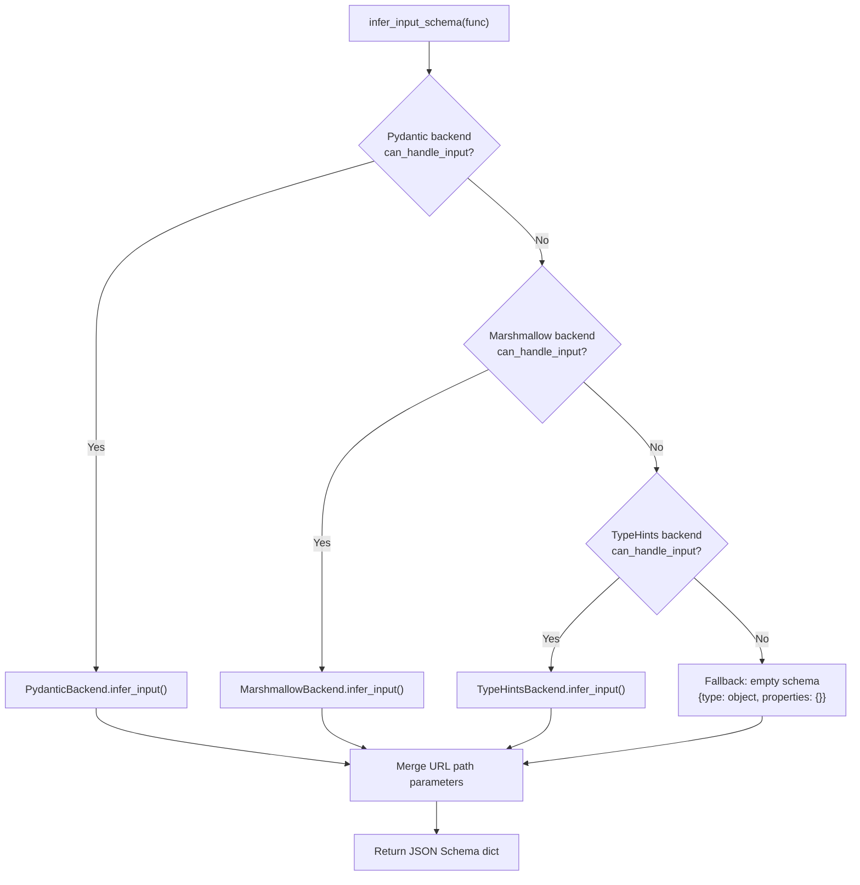

---

## 10. WSGI/Async Bridge

### 10.1 Architecture

The WSGI/async bridge is the mechanism by which synchronous Flask module functions execute within the MCP server's asyncio event loop. It is implemented in the `flask apcore serve` command and the module execution wrapper.

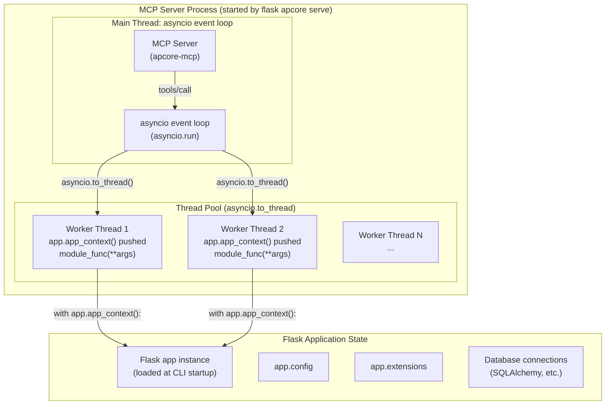

### 10.2 Module Execution Wrapper

```python
def create_module_executor(app: Flask) -> Callable:
    """Create a wrapper that executes sync module functions with Flask app context.

    The MCP server (apcore-mcp-python) calls module functions asynchronously.
    Since Flask modules are synchronous (WSGI), they must execute in a thread
    pool via asyncio.to_thread(). Each thread needs its own Flask application
    context to access current_app, g, and database connections.

    Args:
        app: The Flask application instance.

    Returns:
        An async callable that wraps sync module execution with app context.
    """

    async def execute_with_context(
        module_func: Callable,
        inputs: dict[str, Any],
        context: Context,
    ) -> dict[str, Any]:
        """Execute a module function in a thread with Flask app context.

        This function is called from the MCP server's asyncio event loop.
        It uses asyncio.to_thread() to run the sync module function in
        a thread pool, with Flask's app_context() pushed onto that thread.

        Args:
            module_func: The synchronous module function to execute.
            inputs: Input arguments dict.
            context: apcore Context with identity and trace info.

        Returns:
            Module output dict.
        """
        def _run_in_context() -> dict[str, Any]:
            with app.app_context():
                return module_func(inputs, context)

        return await asyncio.to_thread(_run_in_context)

    return execute_with_context
```

### 10.3 App Context Thread Safety

The key concern is whether Flask's `app_context()` is safe to push from multiple threads simultaneously. The answer is **yes** for application context (but not for request context):

- `app.app_context()` creates a new `AppContext` per push, stored in a `contextvars.ContextVar` (Flask 2.3+) or thread-local (older Flask). This is inherently thread-safe.
- `current_app` resolves correctly per-thread because each thread has its own context stack.
- `g` is per-context (per-thread), so thread-local data does not leak.
- SQLAlchemy's `scoped_session` (via Flask-SQLAlchemy) uses thread-local sessions, which are safe in this model.

**What is NOT safe:**
- `request` context is not available in MCP serve mode (there is no HTTP request).
- `session` (Flask session) is not available in MCP serve mode.
- Module functions that access `flask.request` will raise `RuntimeError`. This is documented as a known limitation.

### 10.4 Serve Command Implementation Sketch

```python
@apcore_cli.command("serve")
@with_appcontext
def serve_command(transport, host, port, name):
    """Start an MCP server exposing registered apcore modules as tools."""
    app = current_app._get_current_object()
    settings = app.extensions["apcore"]["settings"]

    # Resolve transport and options
    transport = transport or settings.serve_transport
    host = host or settings.serve_host
    port = port or settings.serve_port
    name = name or settings.server_name

    # Get registry
    registry = app.extensions["apcore"]["registry"]
    module_count = len(registry.list())
    if module_count == 0:
        raise click.ClickException(
            "No apcore modules registered. Run 'flask apcore scan' first "
            "or define modules with @module decorator."
        )

    # Check apcore-mcp-python installed
    try:
        from apcore_mcp import serve
    except ImportError:
        raise click.ClickException(
            "apcore-mcp is required for 'flask apcore serve'. "
            "Install with: pip install flask-apcore[mcp]"
        )

    # Detect if executor is needed (middleware/ACL configured)
    use_executor = bool(settings.middlewares or settings.acl_path or settings.executor_config)
    registry_or_executor = get_executor(app) if use_executor else registry

    click.echo(f"[flask-apcore] Starting MCP server '{name}' via {transport}...")
    click.echo(f"[flask-apcore] {module_count} modules registered.")

    # serve() calls asyncio.run() internally
    # Module functions will execute via to_thread with app context
    serve(
        registry_or_executor,
        transport=transport,
        host=host,
        port=port,
        name=name,
    )
```

---

## 11. Data Model

### 11.1 Configuration Schema

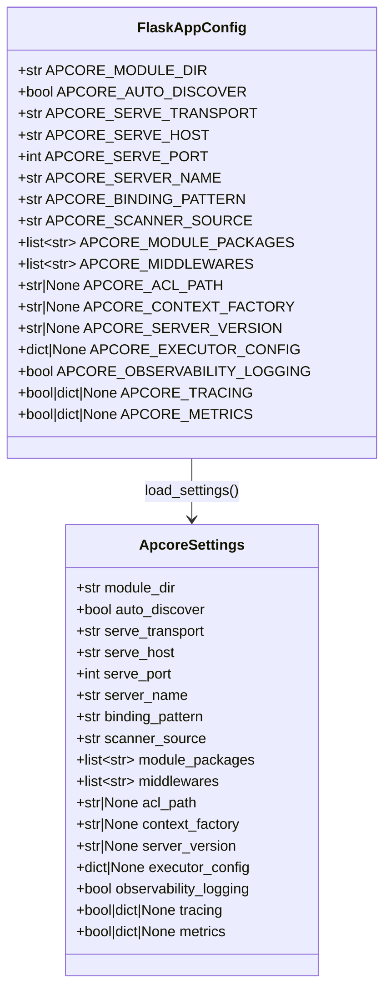

### 11.2 Registry Data Structures

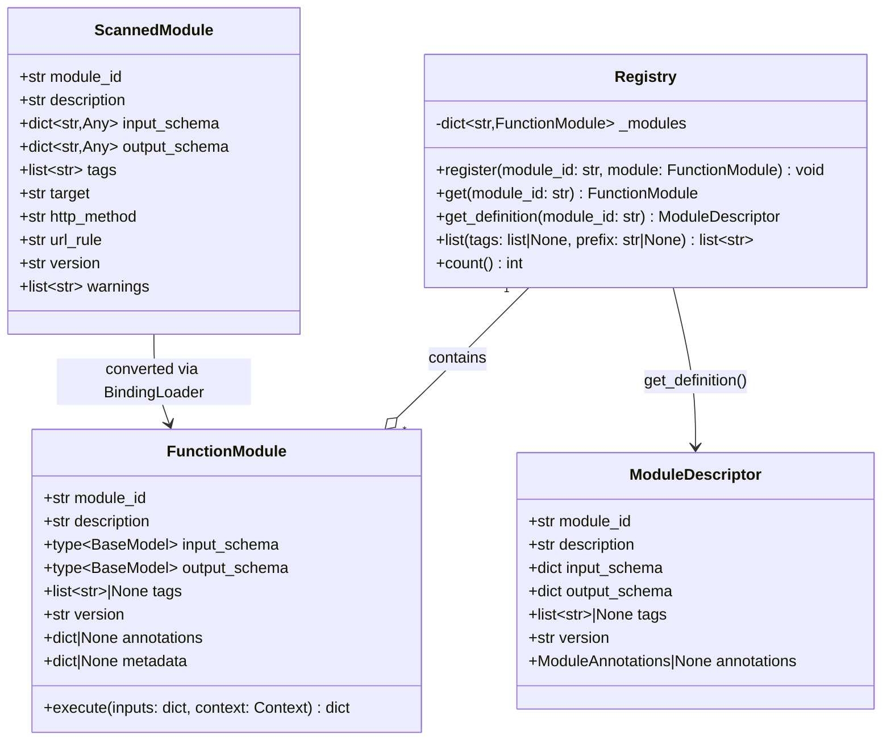

### 11.3 Module Metadata Flow

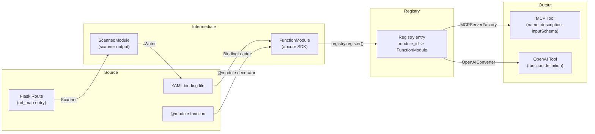

---

## 12. Testing Strategy

### 12.1 Test Categories

| Category | Scope | Tools | Coverage Target |
|----------|-------|-------|----------------|
| Unit Tests | Individual classes and functions | pytest, unittest.mock | 90%+ |
| Integration Tests | Component interactions (scanner -> writer -> loader) | pytest, Flask test client | 80%+ |
| E2E Tests | Full pipeline (Flask app -> scan -> serve -> MCP client) | pytest, mcp Python SDK test utilities | Key scenarios |
| CLI Tests | Click command behavior | Click CliRunner | All commands and error paths |

### 12.2 Key Test Scenarios

#### Unit Tests

| Component | Test File | Key Test Cases |
|-----------|-----------|---------------|
| `ApcoreSettings` | `test_config.py` | Valid defaults; invalid types for each setting; out-of-range port; None-means-default; bool-not-int guard |
| `Apcore Extension` | `test_extension.py` | `init_app()` with defaults; factory pattern; auto-discover on/off; missing module dir; double init_app; invalid config |
| `get_registry()` | `test_registry.py` | Returns registry from app.extensions; raises without init_app; per-app isolation |
| `NativeFlaskScanner` | `test_scanner_native.py` | Blueprint routes discovered; static routes skipped; URL params extracted with correct types; docstrings as descriptions; methods filtered; no-type-hint graceful degradation |
| `SmorestScanner` | `test_scanner_smorest.py` | marshmallow schema extraction from @blp.arguments; response schema from @blp.response; missing schema handled with warning |
| `RestxScanner` | `test_scanner_restx.py` | api.model definitions extracted; @api.expect schema used; Swagger spec iteration |
| `SchemaDispatcher` | `test_schemas.py` | Pydantic model detected and converted; marshmallow field mapping; type hint fallback; empty-params fallback; Union types; Optional handling |
| `YAMLWriter` | `test_yaml_writer.py` | Correct YAML format; directory creation; overwrite behavior; binding compatibility |
| `PythonWriter` | `test_python_writer.py` | Valid Python output; PEP 8; import correctness; Pydantic model generation |
| `FlaskContextFactory` | `test_context.py` | Anonymous context without request; flask-login user identity; g.user identity; basic auth identity |

#### Integration Tests

| Test Scenario | Description | Fixtures |
|---------------|-------------|---------|
| Native scan-to-serve | Create Flask app with Blueprint routes, scan, write YAML, load via BindingLoader, verify registry | Flask test app |
| Smorest scan-to-serve | Create flask-smorest app, scan, write YAML, load, verify marshmallow schemas preserved | flask-smorest test app |
| YAML round-trip | Scan > write YAML > load via BindingLoader > compare schemas match | Any test app |
| Python round-trip | Scan > write Python > import > verify @module attributes and schemas | Any test app |
| Progressive upgrade | Start with scan (Lite), add @module override (Full), verify override takes precedence | Flask test app |

#### E2E Tests

| Test Scenario | Description |
|---------------|-------------|
| Native Flask to MCP | Flask app > scan > serve --stdio > MCP client connects > tools/list > tools/call |
| @module to MCP | Define @module functions > auto-discover > serve > tools/call with Flask context |
| OpenAI export | Populate registry > export --format openai > validate JSON Schema |

### 12.3 Test Fixtures

```python
# tests/conftest.py

@pytest.fixture
def base_app():
    """Create a minimal Flask app for testing."""
    app = Flask(__name__)
    app.config["TESTING"] = True
    return app

@pytest.fixture
def app_with_routes(base_app):
    """Flask app with sample Blueprint routes."""
    bp = Blueprint("users", __name__, url_prefix="/users")

    @bp.route("/<int:user_id>", methods=["GET"])
    def get_user(user_id: int) -> dict:
        """Get a user by ID."""
        return {"id": user_id, "name": "Test User"}

    @bp.route("/", methods=["POST"])
    def create_user(name: str, email: str) -> dict:
        """Create a new user."""
        return {"id": 1, "name": name, "email": email}

    base_app.register_blueprint(bp)
    return base_app

@pytest.fixture
def app_with_apcore(app_with_routes):
    """Flask app with flask-apcore initialized."""
    apcore = Apcore(app_with_routes)
    return app_with_routes

@pytest.fixture
def smorest_app(base_app):
    """Flask app with flask-smorest Blueprints."""
    # Configure flask-smorest test app with marshmallow schemas
    ...

@pytest.fixture
def restx_app(base_app):
    """Flask app with flask-restx Api."""
    # Configure flask-restx test app with Swagger models
    ...
```

---

## 13. Security Considerations

### 13.1 Input Validation

| Input Source | Validation Method | Details |
|-------------|-------------------|---------|
| CLI arguments | Click parameter types and custom validators | Click rejects invalid types before handler; custom validators for regex patterns, port ranges |
| YAML binding files | `yaml.safe_load()` (no arbitrary Python execution) | PyYAML safe_load prevents code injection; schema structure validated by apcore BindingLoader |
| Module execution inputs | Pydantic schema validation via apcore Executor pipeline | Step 5 of the 10-step pipeline validates inputs against the module's input_schema |
| Flask config values | Type checking in `load_settings()` | Each `APCORE_*` setting has explicit type check; no coercion from strings |

### 13.2 Auth Bridging (P2)

For MVP, flask-apcore does not implement auth bridging. All registered modules are accessible to any MCP client that connects. This is documented as a known limitation.

**Planned P2 approach:**
- `FlaskContextFactory` will extract auth tokens from MCP tool call metadata
- Flask-Login `current_user` will be mapped to apcore `Identity`
- apcore ACL rules will control module-level access based on Identity roles

### 13.3 Sensitive Data Handling

| Concern | Mitigation |
|---------|-----------|
| Generated YAML/Python files may contain schema descriptions with internal details | Scanner generates schemas from public API metadata only (docstrings, type hints); internal implementation details are not exposed |
| MCP Server default binding to `127.0.0.1` | HTTP transport defaults to localhost; changing to `0.0.0.0` triggers a warning in CLI output: `"WARNING: Binding to 0.0.0.0 exposes this server to the network."` |
| YAML binding file `target` field contains callable paths | Callable paths are internal to the project; binding files should not be committed to public repos if they reference private APIs |
| Generated Python code with `from myapp.views import X` | Generated code is not executed at generation time; only executed when explicitly loaded |

### 13.4 Dependency Security

- All dependencies are well-maintained packages with active security practices
- `yaml.safe_load()` used exclusively (never `yaml.load()`)
- No evaluation of user-supplied strings as code
- Generated Python code does not use `eval()`, `exec()`, or `__import__()` -- only standard `import` and `from ... import ...`

---

## 14. Performance Considerations

### 14.1 Performance Targets

| Metric | Target | Measurement Method |
|--------|--------|--------------------|
| `flask apcore scan` (50 routes) | < 5 seconds | Wall-clock time |
| `flask apcore scan` (200 routes) | < 15 seconds | Wall-clock time |
| Auto-discovery (100 modules) | < 2 seconds | Flask app startup time impact |
| MCP tools/list response | < 100ms | MCP client round-trip; inherited from apcore-mcp |
| MCP tools/call overhead | < 50ms above module execution time | Thread pool + context push overhead |
| Memory per module | < 500KB | Registry + schema cache |
| Extension init_app() | < 500ms with 50 bindings | Flask startup time impact |

### 14.2 Optimization Strategies

**Scanner Performance:**
- Native scanner iterates `app.url_map.iter_rules()` once (O(N) where N is route count)
- Schema inference is per-function, not per-route (functions used by multiple routes are inferred once via caching)
- Smorest scanner reads marshmallow schemas directly from `_apidoc` attribute (no OpenAPI generation)
- Restx scanner calls `api.__schema__` once per Api instance, then iterates operations

**Registry Performance:**
- Module lookups are O(1) dict access (inherited from apcore SDK)
- Registry is created once per Flask app process lifetime
- No per-request registry operations in MCP serve mode

**Startup Performance:**
- Optional dependencies (flask-smorest, flask-restx, apcore-mcp-python) are imported lazily at first use, not at module load time
- YAML binding files are loaded sequentially via `BindingLoader.load_binding_dir()` (I/O bound, not CPU bound)
- For projects with >100 binding files, a single-pass directory scan with `pathlib.Path.glob()` is used (not recursive walk)

**MCP Serve Performance:**
- `asyncio.to_thread()` uses Python's default `ThreadPoolExecutor` (max_workers = min(32, os.cpu_count() + 4))
- Each module call requires one app_context push (lightweight: creates AppContext and pushes onto context stack)
- No serialization/deserialization overhead beyond JSON (module inputs/outputs are dicts)

### 14.3 System Limits

| Resource | Practical Limit | Behavior When Exceeded |
|----------|----------------|----------------------|
| Scanned routes per command | 10,000 | Warning above 1,000; no hard limit |
| Registered modules in Registry | No hard limit | Warning above 500 (MCP client may struggle with large tool lists) |
| YAML binding files per directory | No hard limit | Warning above 100 for startup time |
| Schema nesting depth | 10 levels | apcore SDK flattens beyond 10 levels |
| Concurrent MCP tool calls | 32 (default thread pool) | Additional calls queued until thread available |

---

## 15. Migration and Compatibility

### 15.1 Version Support

| Dependency | Minimum | Maximum Tested | Notes |
|------------|---------|---------------|-------|
| Python | 3.10 | 3.13 | Required for `X \| Y` union syntax |
| Flask | 3.0 | 3.1.x | Flask 3.x required for modern CLI and context handling |
| apcore-python | 0.3.0 | Latest | Same developer; CI tests against main branch |
| Pydantic | 2.0 | Latest | Pydantic v2 required for `model_json_schema()` |
| flask-smorest | 0.42 | Latest | Optional; tested in CI |
| flask-restx | 1.0 | Latest | Optional; tested in CI |
| apcore-mcp-python | 0.1.0 | Latest | Optional; same developer |

### 15.2 CI Test Matrix

```
Python: [3.10, 3.11, 3.12, 3.13]
Flask: [3.0, 3.1]
Optional extras: [none, smorest, restx, mcp, all]
```

### 15.3 Upgrade Paths

**Lite Mode to Full Mode:**
- No migration required
- `@module`-decorated functions override scanned modules with the same ID
- YAML binding files override scanned modules with the same ID
- Priority: `@module` > YAML binding > scanned

**apcore SDK version upgrades:**
- flask-apcore pins to `apcore >= 0.3.0` (minimum supported)
- YAML binding files are backward-compatible (apcore BindingLoader handles version differences)
- Generated Python code uses standard `@module` decorator API (stable across apcore versions)

---

## 16. Traceability Matrix

| PRD Requirement | Design Component | Section Reference |
|----------------|-----------------|-------------------|
| **PRD-FAP-001** Flask Extension Core | `Apcore` class, `ApcoreSettings`, `get_registry()` | 7.1 Flask Extension, 7.2 Configuration, 7.3 Registry Wrapper |
| **PRD-FAP-002** Blueprint Scanner (Native Flask) | `NativeFlaskScanner`, `SchemaDispatcher` | 7.5.2 Native Flask Scanner, 9 Schema Inference Engine |
| **PRD-FAP-003** @module Decorator Bridge | `Apcore.init_app()` auto-discovery of `@module` functions | 7.1 Flask Extension (auto-discovery flow) |
| **PRD-FAP-004** YAML Binding Support | `Apcore.init_app()` loading via `BindingLoader` | 7.1 Flask Extension (auto-discovery flow) |
| **PRD-FAP-005** MCP Serve Command (STDIO) | `flask apcore serve --stdio`, WSGI/Async Bridge | 8.3 flask apcore serve, 10 WSGI/Async Bridge |
| **PRD-FAP-006** Multi-Backend Schema Inference | `SchemaDispatcher`, Pydantic/Marshmallow/TypeHints/YAML backends | 9 Schema Inference Engine |
| **PRD-FAP-007** Module Auto-Discovery | `Apcore.init_app()` with `APCORE_AUTO_DISCOVER` | 7.1 Flask Extension (auto-discovery flow) |
| **PRD-FAP-008** `flask apcore scan` CLI Command | `scan_command()` Click command | 8.2 flask apcore scan |
| **PRD-FAP-009** flask-smorest Scanner | `SmorestScanner` | 7.5.3 flask-smorest Scanner |
| **PRD-FAP-010** flask-restx Scanner | `RestxScanner` | 7.5.4 flask-restx Scanner |
| **PRD-FAP-011** HTTP Streamable Transport | `flask apcore serve --http` | 8.3 flask apcore serve |
| **PRD-FAP-012** OpenAI Tools Export | `flask apcore export --format openai` | 8.4 flask apcore export |
| **PRD-FAP-013** Dry-Run Mode | `flask apcore scan --dry-run` | 8.2 flask apcore scan |
| **PRD-FAP-014** Scanner Include/Exclude Filters | `--include`/`--exclude` options, `BaseScanner.filter_modules()` | 8.2 flask apcore scan, 7.5.1 Base Scanner |
| **PRD-FAP-015** Schema Validation Report | `flask apcore scan --validate` | 8.2 flask apcore scan |
| **PRD-FAP-016** Flask-Login/flask-httpauth Mapping | `FlaskContextFactory._extract_identity()` (P2 scope) | 7.4 Context Bridge |
| **PRD-FAP-017** Middleware Bridging | Non-goal for MVP | 4.2 Non-Goals (NG-3) |
| **PRD-FAP-018** Admin Dashboard | Non-goal for MVP | 4.2 Non-Goals (NG-4) |
| **PRD-FAP-019** Watch Mode for Serve | Not designed (P2) | -- |
| **PRD-FAP-020** Context Factory | `FlaskContextFactory`, `push_app_context_for_module()` | 7.4 Context Bridge, 10 WSGI/Async Bridge |
| **PRD-FAP-021** Module Health Check Endpoint | Not designed (P2) | -- |
| **PRD-FAP-022** Tag-Based Module Grouping | `ScannedModule.tags`, Blueprint name as tag | 7.5 Scanner System |

---

## 17. Open Design Questions

| ID | Question | Impact | Resolution Plan |
|----|----------|--------|-----------------|
| ODQ-1 | **How should the native scanner detect whether a Flask route returns JSON vs HTML?** The scanner needs to distinguish API routes from template-rendering routes for Lite Mode auto-discovery. Options: (a) inspect function body for `render_template` calls (fragile AST analysis), (b) check if route has `Content-Type: application/json` in response headers (requires calling the route), (c) use heuristics: skip routes with no type hints AND no docstring AND no URL parameters (conservative), (d) let the user configure include/exclude patterns. | High -- affects Lite Mode false positive rate | Phase 2 implementation. Initial approach: conservative heuristic (c) combined with user configuration (d). Skip routes whose endpoint name starts with common template patterns (e.g., `index`, `render_`, `page_`). Always include routes on Blueprints with `url_prefix` containing `/api/`. |
| ODQ-2 | **Should `APCORE_MODULE_PACKAGES` be required or auto-detected?** For `@module` decorator auto-discovery, flask-apcore needs to know which packages to scan. Options: (a) require explicit `APCORE_MODULE_PACKAGES = ["myapp.modules"]` config, (b) scan all importable modules in the project root (slow, potentially imports unrelated code), (c) scan only modules registered via Flask Blueprints. | Medium -- affects @module decorator UX | Decision: (a) explicit configuration for safety and performance. Default is empty list. When `APCORE_MODULE_PACKAGES` is empty and `APCORE_AUTO_DISCOVER` is True, only YAML bindings are auto-loaded (not @module scanning). This prevents accidental imports and is consistent with Flask's explicit-is-better philosophy. |
| ODQ-3 | **What port should the HTTP Streamable MCP server default to?** Flask's default HTTP server uses port 5000. The MCP HTTP server needs a different port. Options: (a) 8000 (common, but conflicts with Django), (b) 9100 (arbitrary, unlikely to conflict), (c) 3000 (common for JS ecosystem). | Low -- configuration option, but default matters for docs | Decision: 9100. Avoids conflicts with Flask (5000), Django (8000), Node.js (3000), and Prometheus (9090). Configurable via `APCORE_SERVE_PORT`. |
| ODQ-4 | **How should the scanner handle Flask MethodView and pluggable views?** Flask's `MethodView` class-based views have a different registration pattern than function-based views. The scanner needs to handle both. | Medium -- affects scanner coverage | Phase 2. The native scanner initially handles function-based views only. `MethodView` support requires iterating over the class methods (`get()`, `post()`, etc.) and generating separate ScannedModule instances per method. This is a known enhancement for post-MVP. |
| ODQ-5 | **Should flask-apcore provide a mechanism for the MCP server to access Flask request-scoped state?** In MCP serve mode, there is no HTTP request. Modules that access `flask.request` will fail. Should flask-apcore provide a mock request or a clearly documented alternative? | Medium -- affects developer experience for modules that need request data | Decision: Document clearly that `flask.request` is not available in MCP serve mode. Modules that need user identity should use apcore's `Context.identity` instead. Provide `FlaskContextFactory` for routes that are called via both HTTP and MCP. The `Context.data` dict can carry arbitrary per-call metadata. |
| ODQ-6 | **How should generated YAML bindings handle the `target` field for methods accessed via `request.get_json()`?** Many Flask routes access request data via `request.get_json()` rather than function parameters. The scanner cannot generate an input_schema for these. | Medium -- affects native scanner quality | Decision: For routes where the function signature has no parameters beyond Flask route arguments, the scanner generates a warning: "Route '{name}' may accept request body via request.get_json(). Consider adding type hints or YAML binding with explicit schema." The input_schema will contain only URL path parameters. Users can manually add input_schema via YAML binding override. |

---

## 18. Appendix

### A. Package Structure

```
flask-apcore/
  src/
    flask_apcore/
      __init__.py              # Apcore extension class, public API exports
      extension.py             # Flask Extension with init_app(), config, startup hooks
      config.py                # APCORE_* config defaults and validation
      registry.py              # App-scoped Registry/Executor access functions
      context.py               # Flask context -> apcore Context bridge
      cli.py                   # Click CLI group: flask apcore [scan|serve|export]
      scanners/
        __init__.py            # Scanner registry, get_scanner(), auto_detect_scanner()
        base.py                # Abstract BaseScanner interface, ScannedModule dataclass
        native.py              # Native Flask route scanner (url_map + view_functions)
        smorest.py             # flask-smorest scanner (optional dependency)
        restx.py               # flask-restx scanner (optional dependency)
      schemas/
        __init__.py            # SchemaDispatcher: multi-backend auto-detection
        base.py                # SchemaBackend abstract interface
        pydantic_backend.py    # Pydantic BaseModel -> JSON Schema
        marshmallow_backend.py # marshmallow Schema -> JSON Schema (optional)
        typehints_backend.py   # Python type hints -> JSON Schema
        yaml_backend.py        # External YAML schema loader
      output/
        __init__.py
        yaml_writer.py         # YAML binding file generator
        python_writer.py       # Python @module decorator code generator
  tests/
    conftest.py                # Flask test app fixtures, shared utilities
    test_extension.py          # Extension init, config, auto-discovery
    test_config.py             # Settings validation
    test_registry.py           # Registry access and isolation
    test_context.py            # Context factory and identity extraction
    test_cli.py                # CLI commands via Click CliRunner
    test_scanner_native.py     # Native Flask scanner
    test_scanner_smorest.py    # flask-smorest scanner
    test_scanner_restx.py      # flask-restx scanner
    test_schemas.py            # Multi-backend schema inference
    test_yaml_writer.py        # YAML output
    test_python_writer.py      # Python output
    test_yaml_binding.py       # YAML binding round-trip
    integration/
      test_native_roundtrip.py # Native Flask: scan -> write -> load -> verify
      test_smorest_roundtrip.py# Smorest: scan -> write -> load -> verify
    e2e/
      test_mcp_serve.py        # Full: Flask app -> scan -> serve -> MCP client
      test_openai_export.py    # Full: Registry -> export -> validate schema
    fixtures/
      native_app/              # Minimal Flask app with Blueprint routes
      smorest_app/             # Minimal flask-smorest app
      restx_app/               # Minimal flask-restx app
      empty_app/               # Flask app with no API routes
      pydantic_app/            # Flask app with Pydantic-typed routes
  docs/
    flask-apcore/
      prd.md
      tech-design.md           # This document
  pyproject.toml
  README.md
  LICENSE
  CHANGELOG.md
```

### B. Dependency Specification

```toml
[project]
name = "flask-apcore"
version = "0.1.0"
description = "Flask MCP Server & AI module integration powered by apcore. Expose Flask routes as MCP tools and OpenAI-compatible functions with zero-config auto-discovery."
requires-python = ">=3.10"
license = "MIT"
keywords = [
    "flask", "mcp", "mcp-server", "flask-mcp", "ai", "apcore",
    "openai", "tools", "ai-agent", "model-context-protocol",
]
dependencies = [
    "flask>=3.0",
    "apcore>=0.3.0",
    "pydantic>=2.0",
]

[project.optional-dependencies]
smorest = ["flask-smorest>=0.42"]
restx = ["flask-restx>=1.0"]
mcp = ["apcore-mcp>=0.1.0"]
all = ["flask-apcore[smorest,restx,mcp]"]
dev = [
    "pytest",
    "pytest-flask",
    "ruff",
    "mypy",
    "pre-commit",
    "coverage",
]
```

### C. Glossary

| Term | Definition |
|------|-----------|
| **apcore** | AI-Perceivable Core -- a schema-driven module development framework protocol |
| **MCP** | Model Context Protocol -- Anthropic's open protocol for connecting AI models to tools |
| **Registry** | apcore's central data structure holding all registered module instances |
| **Executor** | apcore's 10-step execution pipeline (context, safety, lookup, ACL, validation, middleware, execute, output validation, middleware after, return) |
| **FunctionModule** | apcore's wrapper adapting a Python function to the module interface (input_schema, output_schema, execute) |
| **BindingLoader** | apcore's YAML parser creating FunctionModule instances from binding files |
| **ScannedModule** | flask-apcore's intermediate representation of a scanned endpoint |
| **BaseScanner** | Abstract base class for framework-specific scanners |
| **SchemaDispatcher** | Multi-backend router that selects the best schema inference backend per function |
| **Binding file** | YAML file conforming to apcore binding spec (module_id, target, schemas) |
| **stdio transport** | MCP transport via stdin/stdout (used by Claude Desktop, Cursor) |
| **streamable-http transport** | MCP transport via HTTP POST (JSON-RPC) + GET (SSE) |
| **Lite Mode** | Zero-config integration: `Apcore(app)` + `flask apcore serve` auto-discovers all Blueprint routes |
| **Full Mode** | Precise-control integration: `@module` decorator with explicit schemas, ACL, middleware |
| **WSGI** | Web Server Gateway Interface -- Python's synchronous web server standard (Flask's runtime model) |

### D. Comparison with django-apcore Architecture

| Aspect | django-apcore | flask-apcore |
|--------|---------------|--------------|
| Integration point | `AppConfig.ready()` | `Apcore.init_app()` / Extension pattern |
| Configuration | `django.conf.settings` (`APCORE_*`) | `app.config` (`APCORE_*`) |
| CLI | `manage.py apcore_scan/serve` (Django management commands) | `flask apcore scan/serve` (Click CLI) |
| Auto-discovery trigger | `AppConfig.ready()` in Django startup | `init_app()` during Flask app setup |
| Scanner targets | DRF ViewSets (via drf-spectacular), django-ninja endpoints | Flask Blueprints (native), flask-smorest, flask-restx |
| Schema sources | Pydantic (via ninja), DRF Serializers (via drf-spectacular) | Pydantic, marshmallow, Python type hints |
| Async handling | Django's `sync_to_async` | `asyncio.to_thread()` with Flask `app_context()` |
| Singleton scope | Module-level (process-wide) | Per-app (`app.extensions["apcore"]`) |
| Config validation errors | `ImproperlyConfigured` (Django exception) | `ValueError` (standard Python) |
| Scanner auto-detection | `--source ninja\|drf` (explicit) | `--source auto` detects framework (auto-detection) |

### E. References

- apcore Python SDK source: `/Users/tercel/WorkSpace/aipartnerup/apcore-python/src/apcore/`
- apcore-mcp-python source: `/Users/tercel/WorkSpace/aipartnerup/apcore-mcp-python/src/apcore_mcp/`
- django-apcore source: `/Users/tercel/WorkSpace/aipartnerup/django-apcore/src/django_apcore/`
- django-apcore tech-design: `/Users/tercel/WorkSpace/aipartnerup/django-apcore/docs/django-apcore/tech-design.md`
- MCP Protocol Specification: https://spec.modelcontextprotocol.io/
- Flask Extension Development: https://flask.palletsprojects.com/en/3.0.x/extensiondev/
- Flask CLI (Click): https://flask.palletsprojects.com/en/3.0.x/cli/
- Flask Application Context: https://flask.palletsprojects.com/en/3.0.x/appcontext/

### F. Related Documents

- PRD: [docs/flask-apcore/prd.md](./prd.md)
- SRS: Not yet created (chain mode -- PRD available, no SRS).
- Test Plan: To be created as part of testing milestones.

---

*End of document.*
